# 统一权限管理系统分析与设计指南

版本：2.0

日期：2026 年 10 月 2 日

需求基线：[需求规格说明书 2.1](统一权限管理系统需求规格说明书.md)

## 目录

1. [从三个场景开始](#1-从三个场景开始)
2. [从需求和数据流分解问题](#2-从需求和数据流分解问题)
3. [比较拆分与架构方案](#3-比较拆分与架构方案)
4. [模块内部的职责与边界](#4-模块内部的职责与边界)
5. [沿请求追踪对象协作](#5-沿请求追踪对象协作)
6. [把设计落实到代码组织](#6-把设计落实到代码组织)
7. [并发、缓存与性能证据](#7-并发缓存与性能证据)
8. [开发与设计的对应检查](#8-开发与设计的对应检查)
9. [学习任务与参考依据](#9-学习任务与参考依据)

## 1 从三个场景开始

### 1.1 阅读与开发的分工

需求规格规定系统必须表现出的行为及验收条件。本文解释如何分析这些行为、为什么选择当前结构，以及代码完成后如何检查。业务行为以需求规格为准；本文的对象名、伪代码和内部能力是职责示例，具体类、API、字段和数据库表仍需后续详细设计。

读者需要基本的 Java 和 CRUD 经验。可先沿第 1、2、3、5 节理解完整场景，再使用第 4、6、8 节查开发约束。当前没有业务代码或压测结果，所有实际代码位置和性能证据均待补充。

### 1.2 三个贯穿场景

| 场景 | 业务事实与预期 | 暴露的设计问题 |
| --- | --- | --- |
| S1 跨系统登录 | 一名员工从 OA 登录，再进入知识库；可以复用身份，两个系统分别判断权限 | 身份、统一会话、登录结果及操作权限如何分开；外部系统可以相信哪些信息 |
| S2 换角及撤权 | 部门管理员替换该员工在 OA 的角色，随后撤权；后续操作最多 3 秒反映变化 | 单角色约束放在哪里；写入与读取如何协调；缓存为何会影响正确性 |
| S3 员工停用 | 最高管理员停用员工，所有系统分配撤销、所有会话失效 | 哪个模块拥有状态；谁协调跨模块行为；保存与内存失效能否放在同一事务 |

这三个场景已经足以暴露系统的主要复杂性。无需先增加更多业务系统的完整功能，再研究架构。

### 1.3 约束如何成为设计依据

| 需求约束 | 对设计的直接影响 | 可以观察的证据 |
| --- | --- | --- |
| 部门管理员不能跨部门管理 | 所有服务端对象访问都检查管理范围 | 越范围列表、详情、批量和导出均拒绝 |
| 每员工每系统最多一个角色 | 换角是替换操作，必须抵抗并发冲突 | 两名管理员同时修改时不能保留双角色或静默覆盖 |
| 登录成功不代表获权 | 身份生命周期与角色分配各自维护 | 同一员工在 OA 允许、知识库拒绝 |
| 退出或撤权最多 3 秒影响后续请求 | 过期和缓存期限是业务正确性的一部分 | 提交后持续发请求，验证最长旧状态窗口 |
| 万人登录、持续鉴权与管理写入并行 | 分别测量读写路径、限制共享资源 | 完整登录及混合负载的吞吐、P95、失败统计 |
| 本机课程开发 | 优先一个平台进程，保持模块边界 | 两个模拟系统独立接入，源码依赖可检查 |

工程性来自可检查的约束。例如把单角色规则留在页面里，即使页面非常完整，两个并发请求仍可能破坏规则。增加一个消息中间件也不会自动解决这项问题。

### 1.4 控制课程项目的复杂度

| 级别 | 本项目的措施 | 引入依据 |
| --- | --- | --- |
| 本期必要 | 服务端隔离、统一有效权限规则、会话失效、单角色原子约束、审计一致性、边界检查和性能测量 | 直接实现现有需求或防止具体错误 |
| 测量后优化 | 有界本地权限缓存、同键填充协调、查询及连接池优化、审计批处理候选 | 有无缓存基线和瓶颈证据，再比较收益与代价 |
| 后续扩展 | Redis、多节点、消息队列、可靠审计补录、微服务 | 新的部署或业务要求，或单节点测量证明不足 |

课程简化了身份校验和部署范围，仍需实现隔离、并发及失效规则。后续扩展先保留重新考虑条件，不提前创建空服务、空接口或占位基础设施。

## 2 从需求和数据流分解问题

### 2.1 各种模型回答不同问题

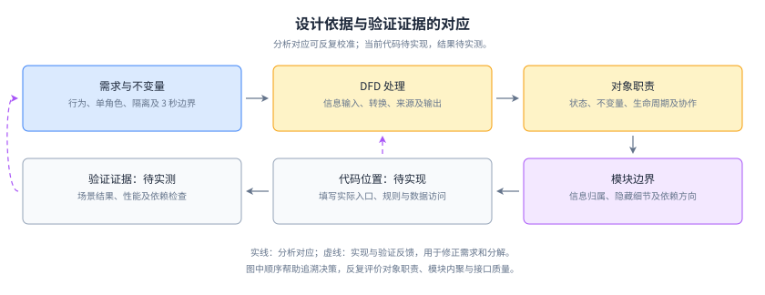

图中连线表示分析对应与反馈。沿 S2 阅读：单角色需求对应授权处理；角色分配对象承担替换约束；授权模块协调保存；并发测试再检查实现是否守住约束。发现测试失败后，需要回到职责或实现判断原因。

| 表达方式 | 回答的问题 | 本项目例子 |
| --- | --- | --- |
| 用例与验收 | 谁在什么条件下需要什么结果 | GRANT-001 要求换角提示及冲突处理 |
| 概念领域模型 | 业务上存在哪些对象及关系 | 员工在每个系统有至多一个角色分配 |
| DFD | 输入被怎样处理，读写哪些业务信息 | P4 综合会话、角色、目录与分配 |
| 对象职责模型 | 哪个对象维护哪个不变量 | 角色分配维护单角色与替换语义 |
| 模块与依赖视图 | 规则归谁，变化经哪些边界传播 | M4 提供角色权限，M5 维护员工分配 |
| 协作与状态图 | 一次场景如何调用，状态如何变化 | 停用提交后使内存会话失效 |

概念对象不必一对象一类，DFD 处理也不必一处理一模块。分析先识别事实和规则，设计再选择代码组织。

### 2.2 读一条鉴权数据流

参见需求[第 3.2 至 3.4 节](统一权限管理系统需求规格说明书.md#32-上下文数据流)。上下文图界定员工、管理员、独立业务系统与平台的边界；一级图将责任分到 P1 至 P5；二级图展开 P4。

在 S2 的后续鉴权中，P4.2 识别系统、员工与会话，输出上下文校验结果。P4.3 对无效上下文产生拒绝；有效时综合部门可用范围、分配、角色和目录。P4.4 返回结论，并把拒绝、异常交给 P5。外部系统收到允许后执行自己的业务及“本人”记录范围校验。

D1 至 D5 是信息集合，尚不是数据库表。图中的查询与更新双向流合并表示同类业务信息；详细设计时可以进一步展开两个方向的内容。DFD 不规定调用先后、线程或进程。

检查层间平衡时，把父处理的每类输入输出列出来，再定位到子处理边界。P4 的授权、查询、鉴权及其结果都应保留；子图不能突然增加外部账号下发。停用在一级图关联 P2 的身份更新、P4 的撤权及 P1 的会话失效，具体协调顺序见第 5.3 节。

### 2.3 变换分析与事务分析

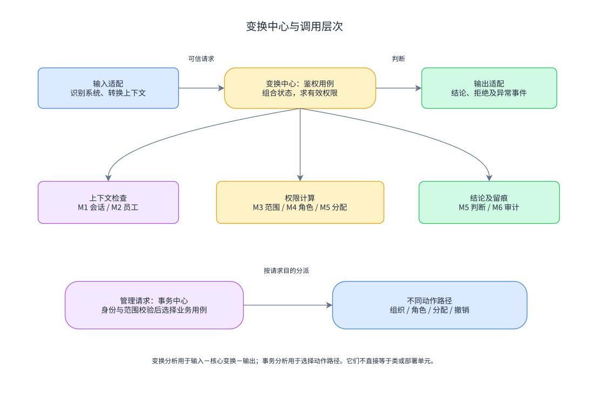

图上半部表示鉴权的输入、核心变换和输出，以及由此得到的初步调用分解。系统来源及会话形成可信上下文；核心规则计算允许或拒绝；输出部分转换结论并记录事件。这是变换分析的适用位置。

下半部表示管理请求按业务目的分派：组织维护、角色配置、换角或撤权。这里的事务分析识别请求类型与处理路径，不要求创建一个处理所有请求的巨大 Dispatcher。多个明确的应用入口也可以表达这些路径。

结构化设计中的“事务”指一次请求处理类型；数据库事务保证若干保存操作共同提交或回滚。换角的原子保存属于后者，两种概念不能混用。

变换分析得到的阶段还需接受模块评价。若把读取员工、读取角色、比较动作分别建成三个服务，调用者会承担执行顺序和状态一致性。把这些步骤藏在一个有效权限能力内，往往更易理解和测试。

### 2.4 再用 OOAD 分配责任

不变量是任何有效状态都必须满足的规则，例如一个员工在一个系统不能同时保留两个未撤销角色。对象设计围绕这类规则及其生命周期展开。

| 责任载体 | 保持的规则 | 所需协作者 |
| --- | --- | --- |
| 统一会话 | 建立时确定绝对期限；到期、退出、员工停用使其失效 | 员工状态查询、登录结果 |
| 登录结果 | 限定系统和期限，只有一次兑换成功 | 接入系统识别、当前会话 |
| 管理范围 | 操作者只能处理所属范围内的对象 | 员工归属、管理员身份 |
| 部门角色 | 权限来自同一系统，模板复制后独立 | 系统可用关系、权限目录 |
| 角色分配 | 员工及角色部门一致，每系统单角色，替换检测旧状态冲突 | 目标角色事实、原子保存 |
| 有效权限规则 | 全部状态有效且角色包含请求动作才允许 | 已取得的可信事实，不自行执行 I/O |

组织资料的简单维护可以集中在应用用例中。会话和角色分配具有明确生命周期与约束，适合显式表达规则。这个区别比先决定所有对象都使用同一种类模板更有用。

## 3 比较拆分与架构方案

### 3.1 三种组织方式的收益与成本

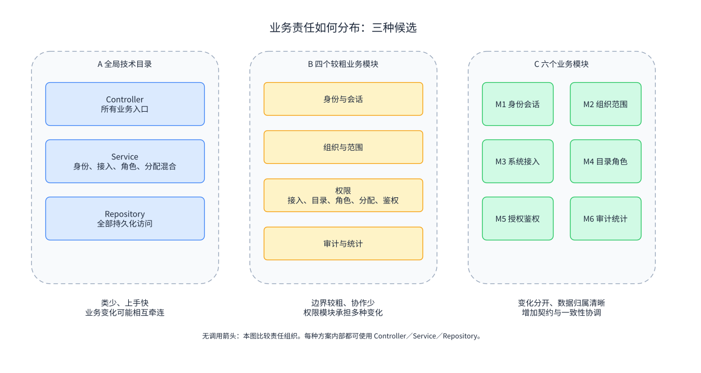

图比较责任分布，没有运行调用箭头。技术目录与业务模块是两个组织维度：Controller／Service／Repository 可以存在于三种方案中。比较的是业务规则是否有独立归属。

| 候选 | 合理之处 | 用 S1、S2、S3 检查得到的成本 |
| --- | --- | --- |
| 全局技术目录，规则集中在少数 Service | 小型 CRUD 上手快，类少，适合探索原型 | 身份、目录、分配混在一起；为 S2 加规则可能影响 S1；目录难以表达禁止跨模块访问 |
| 身份、组织、权限、审计四个较粗模块 | 提供初步边界，团队协调少；接入和权限规则很小时可用 | 接入配置、角色内容和员工分配均落在权限模块，S2 的写入约束与 S1 的接入变化仍相互牵连 |
| 当前六个业务模块，模块内轻量分层 | 接入、目录和分配具有独立数据归属及变化原因，三场景可沿公开能力追踪 | 增加契约和跨模块查询，必须处理事实一致性、协调归属及依赖检查 |

本项目选择六模块：多系统接入与不同权限目录已经是核心需求，进一步分开 M3、M4、M5 有具体收益。若只有一个系统和少量固定角色，四模块也可能足够；模块数量不是通用标准。

### 3.2 从 DFD 得到六个边界

| DFD 处理 | 模块及建议包归属 | 拆分依据 |
| --- | --- | --- |
| P1 | M1 身份认证与会话／identity | 同一身份生命周期，隐藏期限、兑换和失效机制 |
| P2 | M2 组织与管理范围／organization | 员工归属、管理员身份共同决定谁能管理谁 |
| P3 接入部分 | M3 系统接入／integration | 系统身份、返回目标与部门可用范围随接入变化 |
| P3 目录角色部分 | M4 权限目录与角色／catalog | 动作、模板及部门角色共同定义可授予的内容 |
| P4 | M5 授权与鉴权／authorization | 分配与有效权限判断共用规则，防止查询和运行结果分裂 |
| P5 | M6 审计与统计／audit | 事件、可见范围和统计具有独立维护责任 |

P3 拆成两个模块，P4 的多个处理保留在一个模块中。划分依据是规则和变化原因，不能机械复制 DFD 的框框数量。

### 3.3 部署与分层选择

| 决策 | 本期选择及代价 | 候选的适用条件与重新考虑依据 |
| --- | --- | --- |
| 部署形态 | 模块化单体；共享进程资源，仍需检查包边界 | 微服务适合确有独立发布或扩缩需求的能力；需承担网络失败、运维与分布式一致性 |
| 规则隔离 | 业务模块内轻量分层；复杂权限规则可脱离框架 | 完整六边形／整洁架构在多个适配器或替换需求下有收益；每个 CRUD 都复制端口和模型会增加本期维护成本 |
| 权限执行 | 平台实时判断，外部系统执行业务；平台成为可用性依赖 | 长期权限副本减少调用，但撤权受副本期限影响；离线需求出现时需重定一致性上限 |
| 数据访问 | Spring Data JPA 与 MySQL；需学习映射、事务及查询行为 | MyBatis 对复杂 SQL 的控制更直接；有实际查询需求再比较，当前不同时维护两套访问方式 |
| 缓存 | 无缓存正确性基线，测量后使用有界本地缓存；承担陈旧与填充协调 | Redis 有共享状态及多节点价值，但增加部署与失效复杂性；单节点不足或多节点要求出现时再评估 |
| 审计 | 管理状态与事件一起保存，拒绝／异常同步记录；故障期间暂停受控服务 | 可靠暂存与补录可降低审计故障影响，但需恢复、去重和容量策略，本期不实现 |

推荐技术栈为 Spring Boot、Spring MVC、Spring Data JPA、MySQL。框架版本在详细设计时确定。外部接入细节留在适配边界；核心权限规则使用业务事实，而非 HTTP 或 ORM 对象。

### 3.4 用变化检验模块质量

内聚看同一模块是否围绕共同规则变化；耦合看调用者需要知道多少内部知识。信息隐藏让调用者只提出业务目的。深模块用相对清晰的能力隐藏较多复杂性，类多或方法少都不能单独证明模块深度。

| 变化或调用 | 边界应产生的效果 | 需要复查的信号 |
| --- | --- | --- |
| 新增第 18 个系统 | M3 登记接入，M4 接收目录，管理员经 M5 授权 | 在鉴权代码里添加第 18 组系统名称分支 |
| 调整知识库角色的导出权限 | M4 改角色，M5 下次求有效权限反映变化 | 修改员工资料代码或逐系统维护权限副本 |
| 把本地缓存换成另一种存放方式 | 主要影响 M5 的事实读取实现 | 调用者必须自己判断缓存过期和重建顺序 |
| 员工停用 | 协调用例组织 M2、M5、M1、M6，规则仍归各自所有者 | M2 直接修改 M1 会话和 M5 分配存储 |

“判断这个员工能否执行这个操作”是适合的深能力。若公开接口要求调用者先取员工、再取角色、再清缓存、最后自己比对动作，复杂性就泄漏到了每个调用者。

## 4 模块内部的职责与边界

本节的内部图表示概念运行调用或状态访问，方框不承诺对应某个类。M1 至 M6 的源码访问规则见第 6.1 节。公开能力通过业务事实及结果交流，不能直接传递其他模块的持久化实体。

### 4.1 M1 身份认证与会话

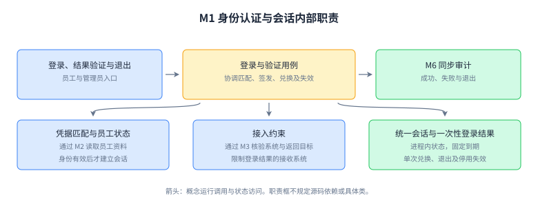

登录用例通过 M2 确认员工，通过 M3 核验目标系统，维护统一会话和登录结果。验证用例检查结果目标、期限、会话状态，并原子消费一次性结果。普通员工和管理员共用身份能力，后台另做管理范围判断。

| 边界 | 说明 |
| --- | --- |
| 拥有 | 会话及登录结果的建立、期限、消费和失效 |
| 不变量 | 会话使用不延长固定 8 小时期限；结果跨系统或重复兑换拒绝 |
| 公开能力与结果 | 根据登录资料或已有会话及目标系统认证／复用，返回受目标限制的登录结果；根据结果及可信系统兑换身份或拒绝；检查指定会话的有效状态；退出返回实际失效状态 |
| 依赖与隐藏 | 查询 M2 员工、M3 接入，交 M6 留痕；隐藏存放、清理、防重放机制，不读取业务角色 |

读图时沿“登录用例”到两类状态看：会话可以跨系统复用，登录结果只用于目标系统的一次兑换。把两者合并会同时破坏复用和防重放。

### 4.2 M2 组织与管理范围

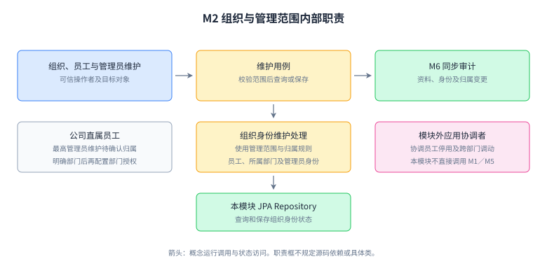

员工及组织维护用例负责资料、唯一性和归属；管理范围规则负责操作者能处理哪些对象。公司直属员工的例外在这里解释，不能把来源表中的岗位名称直接当作管理员身份。

| 边界 | 说明 |
| --- | --- |
| 拥有 | 公司、部门、员工状态及管理员身份 |
| 不变量 | 身份资料唯一；部门没有下级；保留有效最高管理员；员工部门变更按调动流程校验 |
| 公开能力与结果 | 根据操作者及组织／员工变更意图维护，返回保存结果或冲突；查询指定员工的归属和状态；根据操作者及目标对象校验范围，返回已校验范围或拒绝 |
| 依赖与隐藏 | 使用本模块 JPA Repository 和 M6 审计；隐藏导入匹配、唯一性检查及直属员工处理，不反向调用 M1／M5 |

图中的数据访问可以直接使用 Spring Data JPA Repository。员工停用的跨模块协调在上层应用部分，不把所有副作用塞进普通员工资料 Service。

### 4.3 M3 系统接入

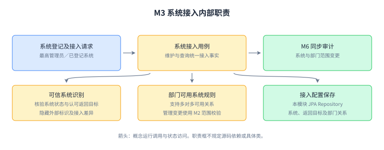

接入配置说明哪个系统可信、允许返回到哪里、哪个部门可以配置该系统。登记了系统不代表员工有角色，部门可用关系也不直接产生操作权限。

| 边界 | 说明 |
| --- | --- |
| 拥有 | 系统身份、状态、认可返回目标及部门可用关系 |
| 不变量 | 调用来源与请求系统一致；返回目标获认可；范围设置由最高管理员完成 |
| 公开能力与结果 | 根据调用来源识别可信系统或拒绝；查询指定系统及部门的状态与可用关系；根据操作者及配置变更意图维护，返回保存结果，影响范围由上层组合查询 |
| 依赖与隐藏 | 使用 M2 范围及 M6 审计；隐藏接入凭据、外部标识转换与返回目标核验，不维护角色分配 |

读图时把“识别系统”与“维护配置”区分开：前者频繁查询，后者改变规则。接入格式变化应主要限制在适配部分。系统或可用范围变更的影响预览由上层组合 M3、M4、M5 的公开查询能力，避免 M3 直接读取角色或分配存储。

### 4.4 M4 权限目录与角色

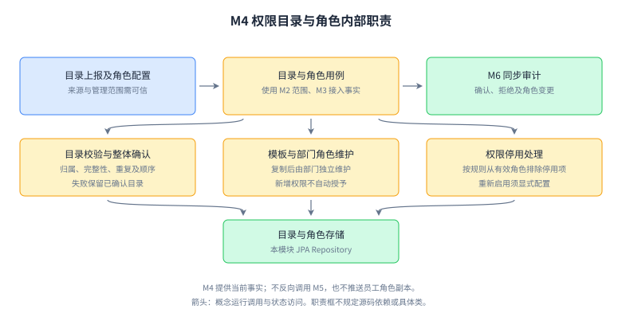

目录接收先校验归属、完整性和顺序，再整体确认。模板复制生成独立部门角色。停用权限从有效角色内容排除，新增权限等待显式配置，模板修改也不覆盖副本。

| 边界 | 说明 |
| --- | --- |
| 拥有 | 目录、全局模板、部门角色及停用语义 |
| 不变量 | 角色权限来自同一系统；部门角色归属明确；失败目录不覆盖已确认内容 |
| 公开能力与结果 | 根据可信系统及目录变更确认或拒绝，并说明原因；根据操作者、归属及权限选择维护角色，返回变化结果；查询指定角色的有效内容及读取依据 |
| 依赖与隐藏 | 查询 M2 范围、M3 接入关系，交 M6 留痕；隐藏来源规范化、版本和复制实现，不反向调用 M5 |

角色修改、停用的受影响员工预览，以及删除前的分配检查，由上层用例组合 M4、M5 的公开能力。检查与变更须防并发冲突，不能在 M4 中直接查询 M5 Repository；预览数量也须遵守操作者范围。

### 4.5 M5 授权与鉴权

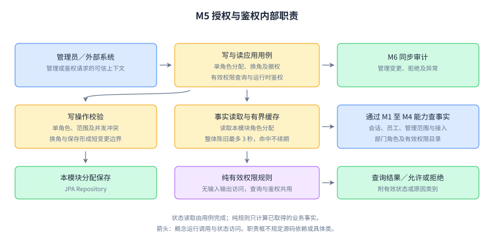

写用例维护分配；事实读取取得身份、会话、接入、目录及分配；纯有效权限规则只根据事实得出结论。后台权限查询与运行时鉴权复用同一规则，其上下文验证不同：管理员可以查询未登录员工，实际操作必须有当前员工会话。

| 边界 | 说明 |
| --- | --- |
| 拥有 | 每员工每系统的角色分配及有效权限组合规则 |
| 不变量 | 每系统单角色；换角检测旧状态；部门归属一致；无效或不可靠事实不能产生允许 |
| 公开能力与结果 | 根据操作者、目标员工、系统、角色及旧状态分配／撤销，返回逐项结果及生效期限；根据可信系统、员工会话及请求操作鉴权，返回允许、业务拒绝或技术失败；按管理范围查询员工权限及失效依据 |
| 依赖与隐藏 | 查询 M1 至 M4 的公开能力，交 M6 留痕；隐藏快照、缓存、事实装配及保存机制 |

图的两条路径在规则和分配事实处相遇。拆分读写职责用于理解和测试，仍在一个模块与一个数据基线中，不要求另建读库或 CQRS 服务。

### 4.6 M6 审计与统计

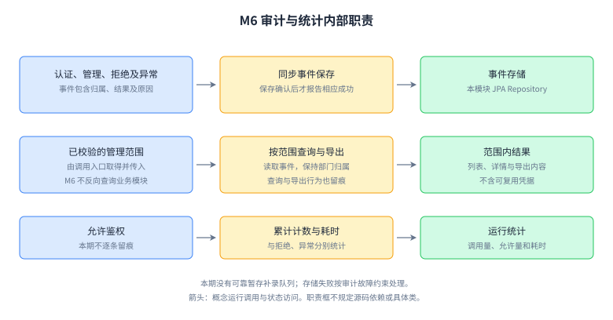

事件写入、按范围查询导出和运行计数具有不同用途。关键事件同步记录；允许鉴权只统计。日志查询入口先通过 M2 校验范围，再把范围值交给 M6，M6 不反向导入组织实现。

| 边界 | 说明 |
| --- | --- |
| 拥有 | 事件、可见归属、统计及导出行为 |
| 不变量 | 正常成功管理变更有对应事件；跨部门日志拒绝；凭据不进入记录 |
| 公开能力与结果 | 接收业务事件，返回保存／失败；根据已校验范围及筛选条件查询导出，返回记录或失败；接收运行结果及耗时，输出说明计时范围的统计 |
| 依赖与隐藏 | 接收业务事件和范围值，不调用业务模块；隐藏查询及存储，本期无可靠补录队列 |

图中的故障出口是暂停受控服务与明确诊断。故障期间审计完整性未知，应报告缺口；不能把普通内存列表描述为可靠事件存储。

## 5 沿请求追踪对象协作

### 5.1 S1：登录结果怎样成为可信身份

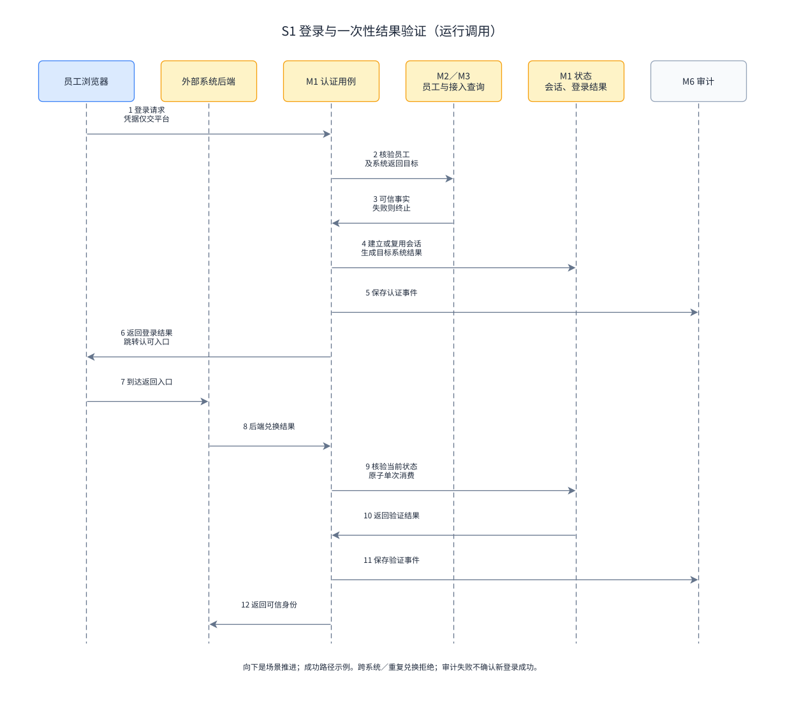

图中横向箭头表示运行调用或返回，向下表示场景推进。为控制宽度，M2／M3 查询能力合为一列，仍分别属于两个模块。浏览器向统一入口提交凭据；外部后端只兑换返回的登录结果。

M1 先核验员工及接入，再建立会话和限定目标的结果，记录认证事件。浏览器返回业务系统；该系统后端在平台成功兑换结果后才建立自己的身份关联。进入知识库时再次走该系统接入，M1 可复用有效会话，但产生知识库专属的新结果。

攻击或错误输入应在可信事实形成前被拒绝：前端不能任意指定员工冒充身份；OA 结果不能在知识库兑换；并发兑换只有一个成功。登录后是否能导出，仍由 M5 判断。

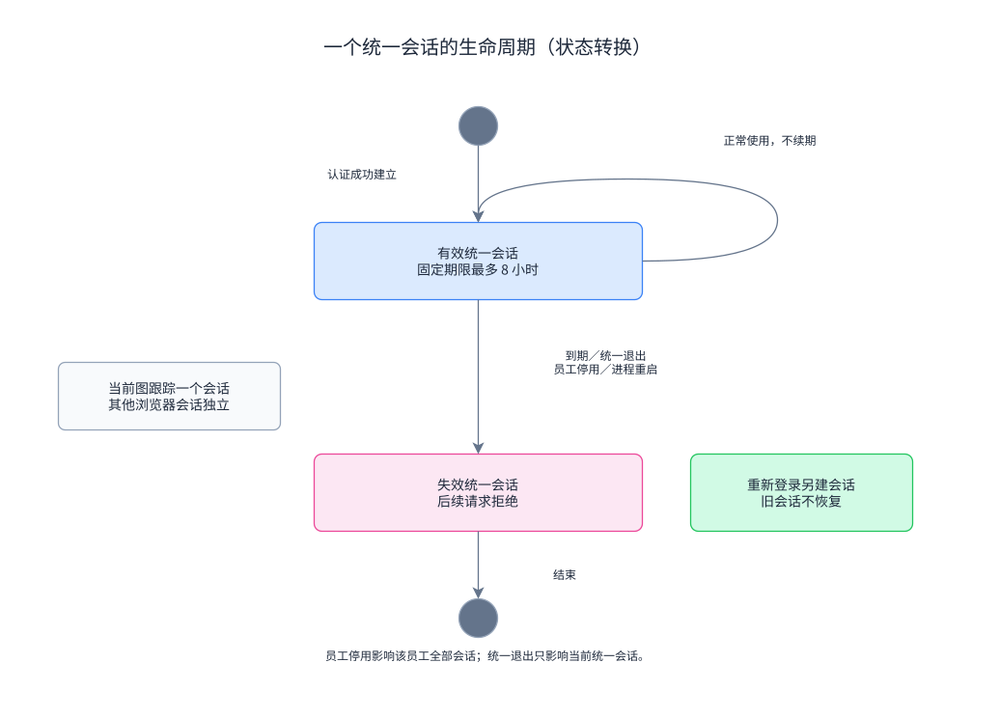

图中箭头是状态转换。会话到期、主动退出、员工停用和进程重启均会使内存会话失效；普通使用不延长原期限。重新登录建立新的会话，不把已失效会话重新启用。

### 5.2 S2：写入分配与读取权限

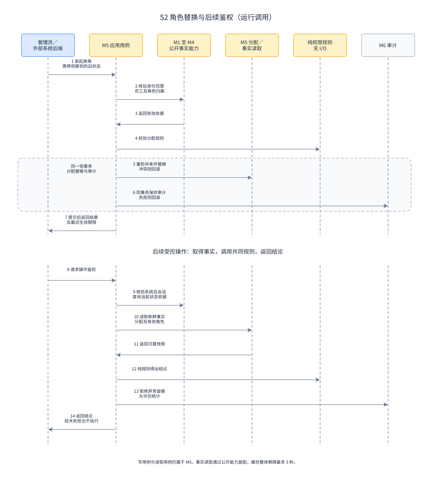

图上部表示写入：用例核验管理员、目标员工及角色归属，事务内重检相关状态仍有效，使用操作者观察到的旧状态检测冲突，原子替换分配并记录审计。事务框中的分配和事件共同提交。下部表示后续读取：取得可靠事实，经同一规则判断，再返回结论。

判断有效权限需同时满足：员工和统一会话有效，系统及部门可用关系有效，存在当前分配，角色和权限项有效，并且角色包含请求操作。后台查询去掉目标员工必须已登录的条件，仍检查操作者身份与范围及目标员工状态。

角色内容在 M4，员工选哪个角色在 M5。撤权修改分配，不关闭统一会话；停用目录权限修改 M4 内容，不逐员工下发角色副本。两条变化都在后续有效权限计算中相遇。

### 5.3 S3：员工停用的原子部分与非原子部分

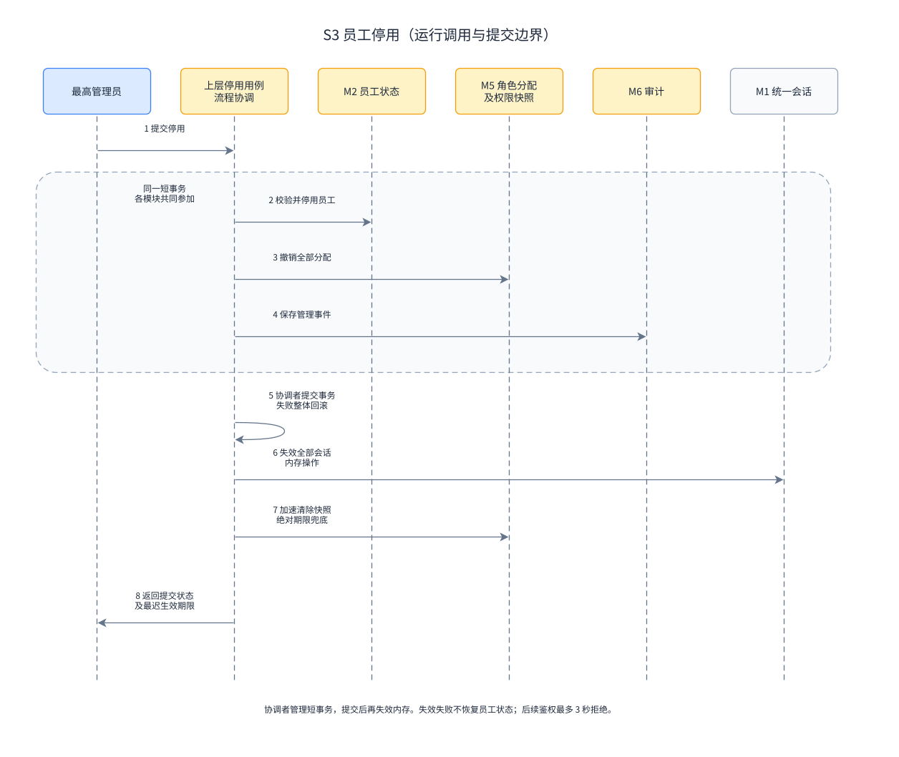

图中上层协调用例分别调用 M2 改员工状态、M5 撤分配、M6 保存事件。这些持久化变更参加同一短事务，各模块能力应支持加入调用者事务；不得各自独立提前提交。协调者拥有流程，不拥有员工或分配的数据访问。

事务提交后调用 M1 使全部会话失效，并加速清除 M5 快照。内存状态不在数据库事务里；若主动失效失败，后续鉴权仍须依据已提交的员工状态及绝对新鲜度期限拒绝。不能把一次线程通知当作唯一正确性保证。

| 失败位置 | 应观察到的结果 |
| --- | --- |
| 保存员工、撤分配或保存管理审计失败 | 持久化变更回滚，不显示停用完成 |
| 提交成功，内存失效失败 | 员工已停用；记录可识别的失效故障，后续鉴权最多 3 秒拒绝；不得重新启用员工来“回滚”缓存 |
| 审计存储不可用 | 不确认新管理变更或新登录成功，暂停新的受控操作；实际退出状态不因日志失败恢复 |

跨部门调动是人工多步骤流程：先撤权并等待生效，再校验分配及旧管理员身份，变更部门，最后重新授权。它不能用一个长事务等待三个管理员完成操作。最终部门变更必须和并发新增授权形成冲突约束。

## 6 把设计落实到代码组织

### 6.1 源码依赖与运行调用分别表达

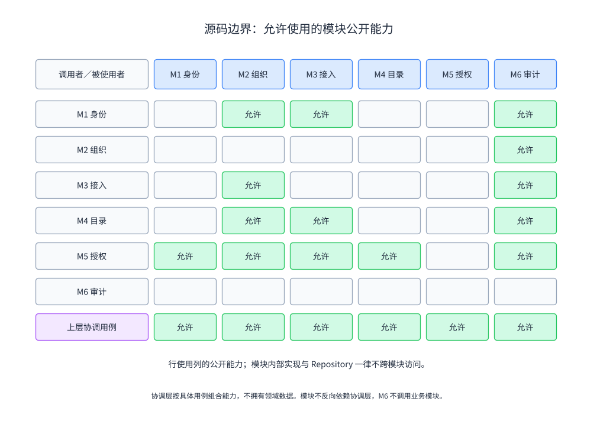

矩阵行是调用者，列是依赖的模块，标记表示可使用其公开能力。它规定源码访问边界，未标记位置不代表某个业务事实完全无关。M6 接收已校验范围值，因此事实来自组织，但不需要导入组织实现。

应用协调层按明确用例组合能力：员工停用用 M2、M5、M1、M6；系统范围及角色变化的影响预览用 M3／M4、M5；角色删除前校验用 M4、M5；日志查询范围用 M2、M6。其他模块不能反向调用协调层。这里的集中协调只覆盖跨模块目标，不取代模块自己的用例。

跨模块只能使用公开能力或稳定结果，禁止访问别人的 Repository、ORM 实体和内部缓存。M4 目录变更不反向调用 M5；如需主动失效，由上层用例连接变化与 M5。绝对期限兜底，不依赖通知必达。

### 6.2 简单维护和复杂规则采用不同内部结构

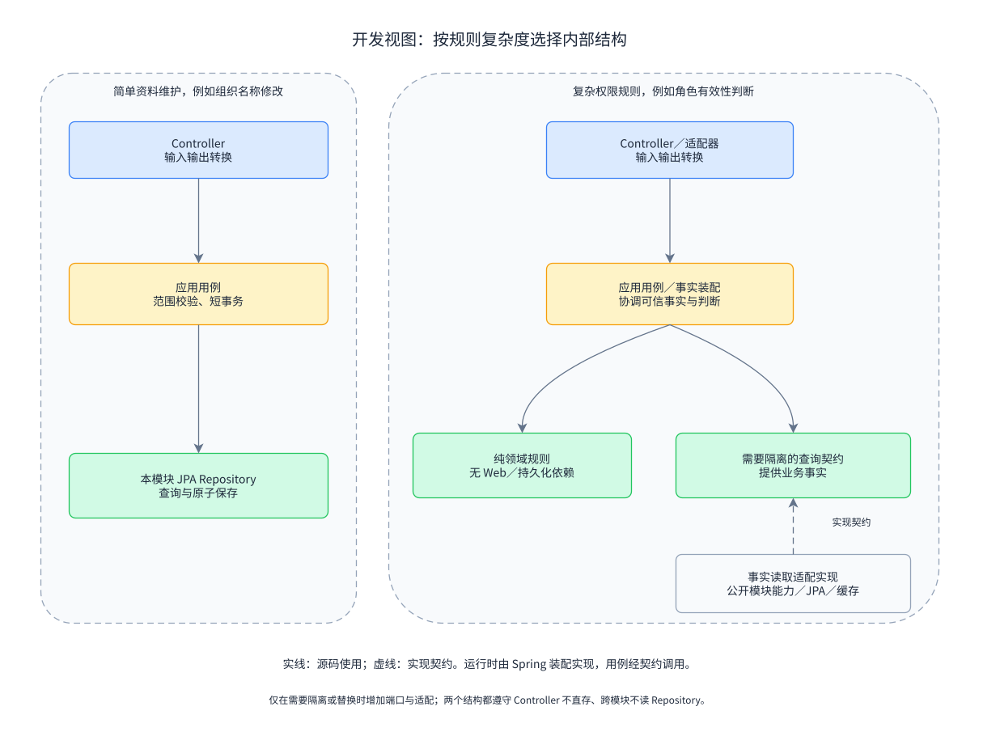

图中实线表示源码使用，虚线表示实现契约。左侧简单维护的应用用例可直接使用本模块 JPA Repository；右侧复杂规则保持纯业务判断，事实装配依赖所需查询契约，适配实现朝契约依赖。运行时 Spring 把实现装配进用例，调用方向和源码依赖方向可以不同。

| 部分 | 适合承担 | 本项目边界 |
| --- | --- | --- |
| 页面／Controller | 表单、输入形式、请求和结果转换 | 服务端用例仍校验范围和业务约束；Controller 不直接保存分配 |
| Application Service／应用用例 | 完成一个业务目标、协调规则和短事务 | 换角用例组织核验、替换、审计，不成为整个后台的通用 Service |
| 领域对象／纯规则 | 维持不变量、依据事实判断 | 有效权限函数不读取数据库，也不接收 HTTP 请求 |
| Repository／数据访问 | 查询、原子保存、持久化转换 | JPA Repository 限本模块；涉及持久化实体的细节留在事实读取／访问边界 |
| 接入 Adapter | 把外部表示转成已校验业务事实 | 系统身份和返回目标经过核验，不能只改参数名称就称为适配 |

建议按 identity、organization、integration、catalog、authorization、audit 建业务包，每个包只设置实际需要的部分。对象转换 Mapper 有表示差异时才存在，不能和 MyBatis 数据访问职责混称。

### 6.3 从具体问题识别模式

| 模式或做法 | 本项目的用处 | 代价及不适用位置 |
| --- | --- | --- |
| Application Service | 用例集中完成换角，协调整个短事务 | 若把所有规则写成流程判断，规则复用及独立测试仍困难 |
| Repository | 隐藏本模块查询和保存，并表达替换冲突 | 不为每张表增加一层只转发 JPA 调用的空接口 |
| Adapter | 将接入来源转换成可信系统事实，隔离外部格式 | 当前统一接入方式无需为 17 个系统各建一个同内容适配类 |
| 值对象 | 以系统和操作共同定义权限，以不可变事实表达范围或判断上下文 | 独立身份对象与按值比较的对象要区分，不把可变 ORM 实体当共享事实 |
| Strategy 候选 | 出现不同的授权算法时可替换算法 | 当前只实施 RBAC0，没有需要选择的多套算法，先用清晰规则 |
| 责任链候选 | 可扩展检查步骤各自处理或拒绝请求时有价值 | 固定的权限合取条件先显式表达；任一步成功不等于整体允许 |
| 事件通知候选 | 可加速缓存失效、解耦非关键后续动作 | 管理审计不能靠易丢失内存通知完成；通知缺失不能违反 3 秒上限 |

Spring 的 singleton 是容器中服务实例的作用域。本项目无需另写一个保存“当前员工”的全局 Singleton。服务对象共享，请求身份和参数保持在调用上下文中。

### 6.4 两段职责示例

以下伪代码表达责任和先后约束，不规定真实方法名或数据字段。后台查询与操作鉴权共用权限计算，进入计算前分别校验适用上下文。

```text
判断操作(请求):
    若受控服务已暂停: 返回技术失败
    上下文 = 核验调用系统及当前会话(请求)
    若不可信: 结论 = 拒绝
    否则:
        事实 = 读取可靠且未超过整体期限的权限事实(上下文)
        结论 = 无法确认时的技术失败，或纯有效权限规则(事实, 请求操作)
    若允许: 仅更新允许计数
    否则: 同步记录拒绝或技术异常
    若必须记录的审计失败: 暂停受控服务；结论 = 技术失败
    若受控服务已暂停: 返回技术失败
    返回结论
```

规则只看输入事实，事实读取负责缓存与一致性。外部系统遇到技术失败也拒绝执行，但统计时应把技术失败和正常权限拒绝分开。

```text
替换角色(操作者, 员工, 目标角色, 观察到的旧状态):
    核验操作者身份、范围及目标归属
    在短事务内:
        重新核验员工、可用关系和角色仍有效
        校验角色分配不变量
        按观察到的旧状态原子替换；冲突则回滚
        保存本次变更审计；失败则回滚
    提交后加速失效受影响快照
    返回成功及最迟生效期限
```

“原子替换”同时要求唯一性约束和旧状态冲突检测；只使用线程安全 Map 或先查后写并不能满足它。具体并发控制机制留给详细设计。批量用例先检查整批管理范围，再按逐人边界处理，并报告部分失败。

### 6.5 用五种视图限制理解范围

| 视图 | 应查的表达 | 解决的问题 |
| --- | --- | --- |
| 逻辑 | 第 3、4 节职责及模块边界 | 一项规则属于谁，变化影响谁 |
| 开发 | 图 G-14、G-15 及实际包依赖 | 哪些代码可以导入哪些能力 |
| 运行 | 图 G-10、G-12、G-13 | 场景中实际调用与提交怎样发生 |
| 物理 | 图 G-16 | 哪些进程和存储需要启动，压力落在哪里 |
| 场景 | S1 至 S3 及验收对应表 | 各视图是否共同解释同一需求 |

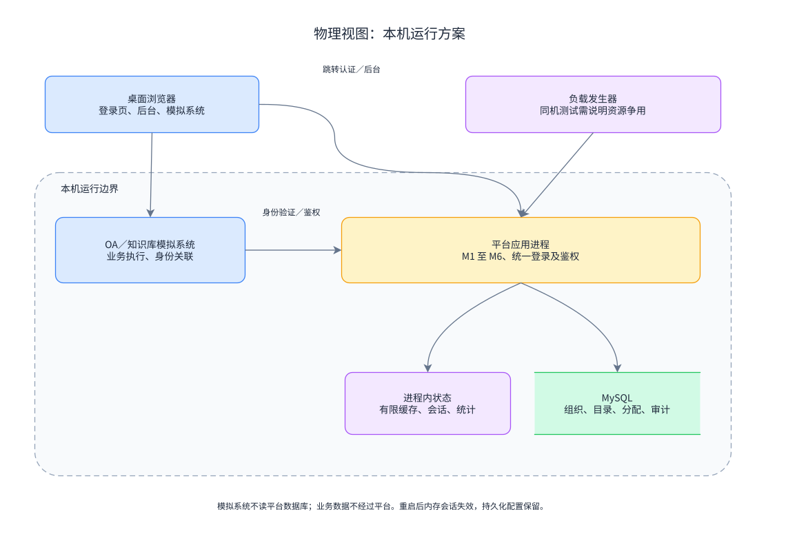

箭头表示进程访问路径。一个平台进程与 MySQL 起步，OA、知识库保持独立入口和业务执行。模拟系统不访问平台数据库；平台不代理业务流量。重启导致内存会话失效，组织、角色和审计等持久化状态保留。

## 7 并发、缓存与性能证据

### 7.1 从目标估算，再用测量纠正

10,000 人／60 秒约为每秒 167 个完整登录流程，一个流程含多次跳转和验证，不能只压测一次用户名匹配。持续鉴权是每秒 1,000 次，5 分钟计划 300,000 次；100 名管理员的写入还可能与它争用数据库和线程。

请求速率、同时在途数量和响应时间不同。估算资源时可用“平均在途数量约等于到达速率乘平均耗时”，前提是测量区间稳定且边界一致；P95 不是平均值。排队持续增长时应报告过载，不能用这个估算宣称稳定容量。

先测正确的无缓存版本，检查查询、N+1、连接等待和日志写入，再引入本地缓存。保留数据量、硬件、负载构成、开放发起速率、失败及超时，才能解释优化收益。详细口径见需求[第 5.2 节](统一权限管理系统需求规格说明书.md#52-时间特性)。

### 7.2 撤权期限约束缓存

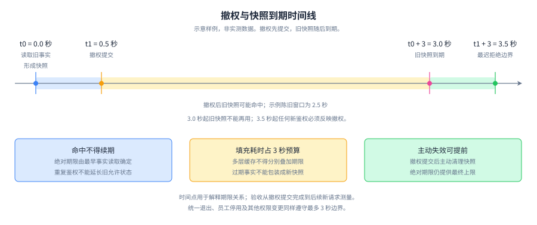

图中箭头表示时间推进，数值是示例。0.0 秒读取旧事实，0.5 秒撤权提交；旧快照最迟在 3.0 秒到期，已经早于从提交起算的 3.5 秒上限。频繁命中不能把到期点向后移动。

快照整体期限从组成事实最早读取时开始，填充耗时占用这段预算。身份、角色和最终判断不能各自缓存 3 秒再串联，旧下层数据也不能给新快照重新获得 3 秒。每次鉴权仍检查会话绝对到期。

主动失效缩短延迟，绝对期限保证失效通知失败后的上限。读取时检测冲突或不能取得一致事实，就重新读取或拒绝；具体事务快照、版本或重检方案在详细设计中确定。外部系统每个受控操作调用平台，不独立缓存允许结论。

### 7.3 并发测试瞄准被破坏的规则

| 竞争情形 | 容易写出的错误 | 应验证的结果 |
| --- | --- | --- |
| 两个员工同时登录 | 单例 Service 成员保存 currentEmployee | 身份不串用，请求状态不保存在共享可变字段 |
| 同一结果同时兑换 | 检查未使用后分别标记 | 只有一个成功 |
| 两个管理员同时换角 | 各自读取旧角色后覆盖 | 单角色保持，检测旧状态冲突 |
| 调动与新增授权并行 | 调动前检查通过，提交前又被授权 | 检测冲突；不能留下旧部门分配 |
| 停用时正在填充缓存 | 把旧读取结果当新快照放入 | 从最早读取计时，超过期限不允许使用 |
| 权限变更与持续鉴权并行 | 只测热缓存允许请求 | 拒绝正确，并满足最长失效期限 |

共享缓存、会话索引和计数使用线程安全机制；多步骤的检查、比较和写入仍需要原子约束。有限超时、缓存容量和资源上限防止未知标识或突发请求形成无限等待。

### 7.4 审计故障的课程边界

审计和管理变更共同提交；运行时拒绝与异常同步记录，允许只统计。审计失败时暂停新的受控请求，恢复后重新判断。退出已经使会话失效时不恢复会话，界面分别说明失效结果和审计失败。

故障诊断及恢复提示应明确该区间审计完整性未知。普通日志可以帮助定位，不能承诺断电、进程退出后所有未写事件可恢复。本期接受已说明的审计缺口，不实现可靠暂存、补录和去重。

若以后要求审计故障仍持续提供服务且事件不丢失，需要可靠记录、容量耗尽处理和恢复验证；这会改变故障策略及部署成本，应重新修改需求与设计。

## 8 开发与设计的对应检查

### 8.1 需求、模块、代码与场景

编号省略共同前缀 UPMS-REQ-。建议归属是开发约束，真实文件和测试完成后再填写。

| 需求 | DFD | 模块／协作 | 建议代码归属 | 实际代码位置 | 验证场景 |
| --- | --- | --- | --- | --- | --- |
| AUTH-001 | P1、P2 | M1 + M2 | identity 认证；organization 管理范围 | 待实现 | ACC-F-002、007 |
| AUTH-002 | P1 | M1 + M2 + M3 | identity 登录与验证；integration 来源识别 | 待实现 | ACC-F-002、004，ACC-P-001 |
| AUTH-003 | P1 | M1 + M3 | identity 会话复用 | 待实现 | ACC-F-003、005 |
| AUTH-004 | P1 | M1 | identity 统一退出 | 待实现 | ACC-F-005、006，ACC-P-005 |
| ORG-001 | P2 | M2 | organization 组织维护 | 待实现 | ACC-F-001、007 |
| EMP-001 | P2、P1、P4.1 | M2；停用协调 M1 + M5 + M6 | organization 资料；上层停用用例 | 待实现 | ACC-F-001、006、014、018 |
| EMP-002 | P2、P4.1 | 协调者 + M2 + M5 | 上层调动用例 | 待实现 | ACC-F-015 |
| ADM-001 | P2 | M2 | organization 管理员身份 | 待实现 | ACC-F-007、018，ACC-P-005 |
| SYS-001 | P3 | M3；影响预览协调 M4 + M5 | integration 系统及可用范围；上层影响查询 | 待实现 | ACC-F-008，ACC-P-005 |
| PERM-001 | P3 | M4 + M3 | catalog 目录确认 | 待实现 | ACC-F-013 |
| ROLE-001 | P3 | M4 | catalog 模板维护 | 待实现 | ACC-F-009 |
| ROLE-002 | P3 | M4；影响预览及删除校验协调 M5 | catalog 部门角色；上层关联查询与校验 | 待实现 | ACC-F-009、012 |
| GRANT-001 | P4.1、P4.4 | M5 | authorization 分配与换角 | 待实现 | ACC-F-010、011 |
| GRANT-002 | P4.1、P4.4 | M5 | authorization 撤权 | 待实现 | ACC-F-011、014，ACC-P-005 |
| AUTHZ-001 | P4.2 至 P4.4 | M5 查询 M1 至 M4 | authorization 用例、事实读取及纯规则 | 待实现 | ACC-F-012、016、018，ACC-P-002、004 |
| QUERY-001 | P4.2 至 P4.4 | M5 + M2 | authorization 有效权限查询 | 待实现 | ACC-F-008、012、014 |
| AUDIT-001 | P5 | M6；上层入口使用 M2 范围 | audit 查询导出与故障状态 | 待实现 | ACC-F-017 |

### 8.2 代码完成后如何检查

选 S1、S2、S3 各一次真实操作，定位入口、用例、规则和保存，再与协作图对照。检查事务参加方式、调用方向和缓存事实来源，不能只证明类名与图中方框相似。

| 检查方式 | 检查内容 | 可提供的证据 |
| --- | --- | --- |
| 代码走读 | 数据归属、规则位置、请求状态及事务边界 | 实际文件、关键调用及对应需求 |
| ArchUnit 或等价依赖检查 | 跨模块仅使用公开契约，无循环；Controller 不直接存取；纯规则不依赖 Web／持久化 | 自动检查结果及违反规则的反例 |
| 规则与场景测试 | 隔离、单角色、会话、目录失效、调动、审计故障 | 输入条件、预期与实际结果 |
| 并发与性能测量 | 竞争正确性、3 秒期限、完整登录及混合负载 | 版本、环境、吞吐、P95 和失败统计 |

静态依赖检查无法证明缓存期限或角色替换原子性，动态测试也不能代替所有源码边界检查。两类证据一起说明代码与设计是否相符。

发现偏离后，先判断规则被破坏，还是新事实证明边界不合适。修复前者；调整后者时记录新依据、受影响需求和代价，更新图及对应表并重测。

### 8.3 怎样向组员讲清设计

围绕一次真实操作组织说明：员工需要什么结果、平台读了哪些事实、哪个规则作判断、为何由该模块承担、候选方案有什么不同、最后用什么证据检查。

例如说明撤权时，展示 S2 的分配变化及时间线，再定位规则和缓存实现，展示持续请求中的拒绝时间。这样可以解释“实时”的边界，也可以说明主动失效失败时为何仍应正确。

尚无代码时用图和场景解释设计；有代码后用实际位置和测试结果替换“待实现”。未达标的测量结果应说明瓶颈和修改依据，不把设计目标作为项目成绩。

## 9 学习任务与参考依据

### 9.1 六个短任务

可先遮住右列，独立画出受影响状态或写出判断，再与参考比较。

| 任务 | 参考判断 |
| --- | --- |
| L1 职责分配：目录停用“导出”时，M4 是否要逐员工删除角色分配？ | M4 改目录有效性；M5 判断时排除停用项。分配关系可以保留，不需账号或角色副本下发。 |
| L2 变更影响：新增第 18 个系统，需要给鉴权规则加系统名称分支吗？ | M3 登记、M4 接目录、管理员配置角色与 M5 授权。规则处理系统身份及权限事实；特殊业务数据仍由外部系统处理。 |
| L3 并发换角：甲乙都看见角色 A，甲改 B 成功，乙再改 C，单角色是否已足够？ | 只保留 C 虽满足唯一性，却可能静默覆盖甲。乙的旧状态已过期，需检测冲突；唯一性和冲突检测分别验证。 |
| L4 会话失效：OA 撤权、当前浏览器统一退出、员工停用各影响什么？ | 撤权只影响 OA 分配；退出影响该统一会话的所有系统，其他浏览器独立会话保留；停用影响全部分配及会话。 |
| L5 缓存期限：0 秒读旧事实、0.5 秒撤权，2.9 秒命中后把期限改到 5.9 秒，是否正确？ | 错误。命中不能续期，旧快照最迟 3 秒到期；3.5 秒后的新鉴权必须反映撤权。再检查填充过程及多层缓存是否延长期限。 |
| L6 代码边界：Controller 直接读 M4 Repository 和 M5 Repository 拼权限，与先调 M5 判断有什么区别？ | 前者泄漏存储、重复规则并绕过范围与新鲜度检查。应由 M5 用公开事实能力装配，再调用纯规则；用依赖检查及运行场景证明。 |

### 9.2 参考材料怎样影响本设计

| 材料 | 采用的思路 | 本期取舍 |
| --- | --- | --- |
| [《软件设计的哲学》规则](https://github.com/ciembor/agent-rules-books/blob/main/a-philosophy-of-software-design/a-philosophy-of-software-design.mini.md) | 信息隐藏、模块深度、理解成本 | 用统一判断能力隐藏事实和缓存；避免把每个执行步骤拆成浅服务 |
| [《整洁架构》规则](https://github.com/ciembor/agent-rules-books/blob/main/clean-architecture/clean-architecture.mini.md) | 边界与依赖方向、规则可测试 | 复杂规则隔离框架，简单维护不强制复制多环模型和端口 |
| [《企业应用架构模式》规则](https://github.com/ciembor/agent-rules-books/blob/main/patterns-of-enterprise-application-architecture/patterns-of-enterprise-application-architecture.mini.md) | 应用 Service、Repository、事务和对象映射 | 按规则复杂度组合用例和对象，不为全部 CRUD 构建复杂聚合 |

上述链接来自 [agent-rules-books](https://github.com/ciembor/agent-rules-books) 第三方规则集，不是作者或出版社的正式书籍摘要。用具体场景检查建议是否适用，不以引用书名替代设计依据。

技术职责参见 [Spring MVC](https://docs.spring.io/spring-framework/reference/web/webmvc.html)、[Bean 作用域](https://docs.spring.io/spring-framework/reference/core/beans/factory-scopes.html)、[Spring Data JPA](https://docs.spring.io/spring-data/jpa/reference/)。需求来源、表格复核及统一登录交互参考集中在需求文档，避免重复维护。

后续详细设计需确定登录协议与结果期限、可信系统身份、具体接口、持久化与并发控制、框架版本和模块公开类型。它们必须实现本文已有的职责及需求约束，再通过第 8 节建立实际代码与证据对应。
