# 统一权限管理系统需求规格说明书

版本：2.1

日期：2026 年 10 月 2 日

配套文档：[分析与设计指南](统一权限管理系统分析与设计指南.md)

## 目录

1. [引言](#1-引言)
   1. [编写目的](#11-编写目的)
   2. [项目背景](#12-项目背景)
   3. [定义](#13-定义)
   4. [参考资料](#14-参考资料)
2. [任务概述](#2-任务概述)
   1. [目标](#21-目标)
   2. [运行环境](#22-运行环境)
   3. [条件与限制](#23-条件与限制)
3. [数据描述](#3-数据描述)
   1. [领域模型](#31-领域模型)
   2. [上下文数据流](#32-上下文数据流)
   3. [一级数据流](#33-一级数据流)
   4. [关键二级数据流](#34-关键二级数据流)
4. [功能需求](#4-功能需求)
   1. [功能划分](#41-功能划分)
   2. [功能描述](#42-功能描述)
   3. [业务流程](#43-业务流程)
5. [性能需求](#5-性能需求)
   1. [数据精确度](#51-数据精确度)
   2. [时间特性](#52-时间特性)
   3. [适应性](#53-适应性)
6. [运行需求](#6-运行需求)
   1. [软件接口](#61-软件接口)
   2. [故障处理](#62-故障处理)
7. [其它需求](#7-其它需求)
   1. [可用性](#71-可用性)
   2. [权限隔离与安全](#72-权限隔离与安全)
   3. [审计与一致性](#73-审计与一致性)
   4. [功能验收](#74-功能验收)
   5. [课程演示与文档验收](#75-课程演示与文档验收)

## 1 引言

### 1.1 编写目的

本文规定系统的业务范围、参与者、信息流、功能、性能和验收条件，供开发人员、测试人员及课程组员共同使用。配套指南说明分析过程、模块边界、设计取舍和开发验证。两份文档中的同一需求以本说明书的行为和验收条件为准。

本文描述需求层面的业务信息及交换责任。具体通信协议、接口地址、请求字段、数据库表和类级详细设计在后续设计中确定。

### 1.2 项目背景

集团现有多个由不同开发商建设的独立业务系统。各系统分别维护账号与权限，员工重复登录，管理人员分散授权，集团难以集中了解员工拥有哪些访问权限。

本项目统一维护员工身份、业务系统权限目录和角色授权。员工在业务系统选择统一账号登录，浏览器跳转至统一认证入口。业务系统取得经平台验证的身份后，在执行受控操作前向平台查询权限。最高管理员与部门管理员通过管理后台维护配置。

早高峰期间，10,000 名员工可能在 60 秒内发起登录，之后继续产生鉴权请求。平台承担认证、会话和权限判断压力。外部业务系统承担业务数据处理及业务操作执行。

2.0 版新增员工统一登录、跨系统会话复用、统一退出和实时鉴权，部门与系统改为多对多。外部系统直接使用统一身份，本期不再主动推送外部账号或角色副本。

### 1.3 定义

| 术语 | 定义 |
| --- | --- |
| UPMS／平台 | 统一权限管理系统，包含统一认证入口、管理后台和供业务系统使用的身份验证与鉴权能力。 |
| 认证 | 确认登录者身份。本 Demo 使用用户名与手机号同时匹配。 |
| 鉴权 | 判断已识别员工能否在某个业务系统执行某个功能点的某种操作。 |
| 统一会话 | 员工登录后建立的身份状态。同一浏览器可复用，固定有效期最多 8 小时。 |
| 登录结果 | 供发起登录的已登记系统验证员工身份的结果，需限制接收系统、有效期和重复使用。 |
| 公司／部门 | 公司包括总公司和 9 个分公司；部门是公司下的末级管理单元。 |
| 最高管理员 | 固定平台管理身份，可管理全部数据与功能。 |
| 部门管理员 | 固定平台管理身份，只维护所属部门员工、部门角色及授权。 |
| 外部系统 | 独立建设的业务系统，接入统一登录与实时鉴权，并上报自己的权限目录。 |
| 部门可用系统 | 最高管理员允许某部门配置角色和员工授权的系统集合。它不直接授予员工权限。 |
| 权限项 | 某系统中一个“功能点 + 操作动作”组合。 |
| 全局角色模板 | 最高管理员维护的、属于一个系统的角色权限样板，不能直接分配给员工。 |
| 部门角色 | 属于一个部门及一个系统的权限集合，员工通过它取得权限。 |
| 有效权限 | 员工、系统、部门可用范围、分配、角色和权限项均有效时，当前角色提供的权限。 |
| RBAC0 | 员工通过角色取得权限；本期无角色继承、直接个人权限及多角色合并。 |
| 业务数据范围 | “本人”等对业务记录的限制，由外部系统结合统一身份执行。 |
| 管理范围 | 部门管理员能管理哪些员工和配置，与业务数据范围分别校验。 |
| P95 | 95% 的测量样本耗时不超过该值。 |
| 技术失败 | 超时、连接失败、非预期服务错误或未完成预期流程。预期权限拒绝不属于技术失败。 |

用例编号采用 `UPMS-REQ-<业务域>-<序号>`，序号在业务域内从 001 开始。

| 业务域 | 代码 | 范围 |
| --- | --- | --- |
| 身份认证与会话 | AUTH | 后台登录、员工登录、会话复用、统一退出 |
| 组织／员工／管理员 | ORG／EMP／ADM | 基础数据、调动、管理员任命 |
| 外部系统 | SYS | 系统登记、启停、部门可用范围 |
| 权限目录 | PERM | 目录接收、变更、停用、失败重报 |
| 角色／授权 | ROLE／GRANT | 模板、部门角色、角色分配及撤销 |
| 运行时鉴权 | AUTHZ | 操作权限判断及故障拒绝 |
| 查询／审计 | QUERY／AUDIT | 有效权限查询、日志筛选与导出 |

功能验收编号为 `ACC-F-<序号>`，性能验收编号为 `ACC-P-<序号>`。

### 1.4 参考资料

| 资料 | 用途 |
| --- | --- |
| [PayReqSPEC.pdf](PayReqSPEC.pdf) | 七章结构、功能划分、用例表格和业务流程格式。 |
| [市政公司员工信息表.xlsx](市政公司员工信息表.xlsx) | 10,000 名员工及身份、组织、岗位资料。 |
| [市政公司部门信息表.xlsx](市政公司部门信息表.xlsx) | 公司与部门的初始化归属。 |
| [市政公司应用软件功能权限清单.xlsx](市政公司应用软件功能权限清单.xlsx) | 系统、模块、功能点及五类初始岗位权限。 |
| [厦门大学信息门户](https://i.xmu.edu.cn/)及[统一身份认证页](https://ids.xmu.edu.cn/authserver/login) | 统一登录跳转的交互参考。仅借鉴已观察到的门户跳转与返回方式，不推断其内部鉴权实现。 |
| 本项目确认的需求基线 | Demo 登录方式、管理角色、授权边界、性能及演示范围。 |

## 2 任务概述

### 2.1 目标

1. 集中维护组织和员工身份，管理员按管理范围维护数据。
2. 为多个独立系统提供统一登录，同一浏览器访问多个系统时免重复输入身份信息。
3. 接收各系统不同的权限目录，按部门维护角色与员工授权。
4. 业务系统执行受控操作前取得统一鉴权结论，权限变更最多 3 秒影响后续请求。
5. 支持早高峰登录与持续鉴权，并给出可复现的性能测试条件。
6. 通过两个模拟业务系统展示登录、授权、拒绝、撤权及故障处理。
7. 保留关键事件审计，以需求、DFD、模块和测试对应关系支持课程验收。

### 2.2 运行环境

管理后台、统一登录页和模拟业务系统通过当前主流桌面版 Chrome、Edge 访问，不要求移动端适配。系统先在本机开发和演示。

普通员工只能使用认证入口和所获授权的外部系统。最高管理员与部门管理员额外拥有后台入口。平台管理员身份不会自动赋予外部系统业务角色。

具体技术结构及本地部署方式见配套分析与设计指南。

### 2.3 条件与限制

#### 2.3.1 初始化资料与处理口径

| 来源 | 复核结果 | 初始化处理 |
| --- | --- | --- |
| 员工表 | 10,000 人；用户名和手机号各有 10,000 个唯一、非空值；总公司 190 人，9 个分公司各 1,090 人 | 保留全部员工。岗位名称不自动产生平台管理员身份或业务授权。 |
| 部门表 | 111 个组织节点，包括 10 个公司、101 个末级部门 | 平台按公司和部门两层展示；保留分公司属于总公司的来源说明，不增加第三层部门。 |
| 员工组织归属 | 9 个分公司各有 6 人以公司节点填入“部门”，共 54 人；其余 9,946 人可对应末级部门 | 54 人保留公司直属、部门待确认状态，由最高管理员维护。明确部门前可认证，不能任命为部门管理员或分配部门角色。不自动归入同名或任意部门。 |
| 权限表 | 18 个系统名称、359 条功能点记录，其中“系统管理后台”21 条，外部系统338条 | “系统管理后台”对应本平台，保留 17 个外部系统；功能点数量不等于拆分后的权限项数量。 |
| 五类岗位列 | 系统管理员、公司领导、部门经理、项目经理、普通员工 | 每个外部系统生成五类全局模板，名称不决定平台管理身份。 |

部门名称在不同公司可能重复，匹配时使用公司与部门完整归属。员工表中的部门简称与部门表中的“分公司名-部门名”按所属公司对应。

初始系统包括 OA 协同办公系统、企业即时通讯系统、企业知识库管理系统、人力资源管理系统、财务管理系统、工程项目管理系统（PMIS）、招投标管理系统、物资设备管理系统、移动巡检 APP、工地 AI 视频监控系统、GIS 地下管线管理系统、企业档案管理系统、车辆管理系统、企业宣传平台、安全生产管理系统、合同全生命周期管理系统、成本管控系统。

权限单元格按斜杠拆分动作，`view`规范为“查看”。“无”及空值不授予权限。“全部”涵盖初始化时该功能点已列出的具体动作；若仅出现“全部”而没有具体动作，该功能点标记待目录确认，不能将“全部”当作可执行动作。外部系统后续上报的完整目录是其动作定义依据。

“查看本人”“编辑本人”保留操作含义及“本人”范围说明，由外部系统限制实际业务记录。平台允许操作的判断不替代这项数据范围校验。

#### 2.3.2 管理与授权规则

1. 公司、部门、员工和系统可停用。组织有有效关联对象时，先处理关联数据再停用；有历史审计的数据不物理删除。
2. 一个部门可使用多个系统，一个系统可供多个部门使用，均可暂未配置。只有最高管理员能改变这项范围。
3. 固定平台角色为最高管理员、部门管理员。最高管理员人数不限，每部门可有多名部门管理员。首个最高管理员由课程初始化配置，后续任命走管理用例；至少保留一名有效最高管理员。
4. 部门管理员所属部门同时是其管理范围；公司直属员工仅由最高管理员维护。最高管理员可代办任意部门操作。
5. 模板和部门角色只属于一个系统。模板复制后独立维护，模板后续变更不覆盖部门角色。
6. 每名员工在每个系统最多有一个未撤销角色分配；分配部门必须与员工当前部门相同。不能直接给员工配置单项权限。
7. 部门范围被移除、系统或角色停用时，现有配置可保留供查询，但不能产生有效权限；重新启用前明确提示是否恢复原有效配置。正式删除角色前先撤销分配。
8. 调动前撤销全部系统的角色分配，等待撤权生效，并取消原部门管理员身份。调动后无角色，不按名称或模板自动继承。

#### 2.3.3 登录与外部系统责任

1. 员工使用用户名和手机号同时校验，无密码、短信验证码。登录信息仅在统一登录页提交，不通过外部系统页面收集。
2. 本期接入基线为浏览器跳转。已登记系统的后端验证登录结果，取得统一身份，再发起鉴权。
3. 统一会话固定有效期最多 8 小时，使用会话不延长绝对到期时间。到期、统一退出或员工停用后，最多 3 秒拒绝新的鉴权。
4. 登录成功只证明身份有效。无目标系统角色、无操作权限或目标系统停用时，拒绝访问相应业务功能。
5. 不主动创建或同步外部账号，不推送角色副本；外部系统可维护自己的业务记录和会话关联，但身份、有效授权以平台为准。
6. OA 审批及线下授权申请流程由平台外部完成，管理员收到通知后配置权限。平台不处理审批。
7. “网关”在本项目中指统一认证和鉴权入口，业务请求及业务数据不由平台代理转发。

#### 2.3.4 课程限制

本项目用于 OOAD 课程分析、设计与开发演示。保留会话校验、系统身份校验、范围隔离和拒绝越权等基本约束；用户名与手机号匹配不能提供生产系统所需的身份安全保证。

本期不要求密码策略、短信认证、多因素认证、多活容灾、工业级监控、生产合规及备份恢复。性能目标需实际测试，不能以课程 Demo 为由略过正确性验证。

## 3 数据描述

### 3.1 领域模型

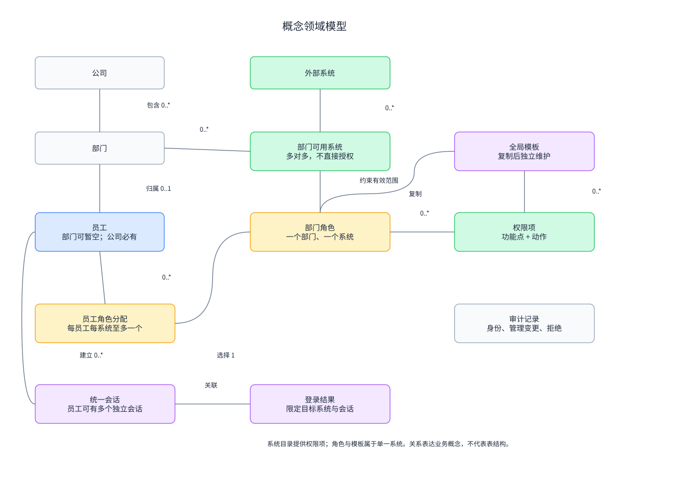

公司拥有部门和员工。员工通常属于一个部门，54 名公司直属员工允许部门暂空。部门与系统的可用关系是多对多。部门角色由一个部门拥有，并使用一个系统的有效权限项；员工在各系统分别取得至多一个角色。

统一会话属于员工，登录结果与目标系统及该会话关联。鉴权读取身份状态、系统状态、部门可用范围、角色分配和有效权限。审计记录保存认证、管理变更及鉴权拒绝等事件。

图中的概念及关联不表示数据库表或持久化结构。

### 3.2 上下文数据流

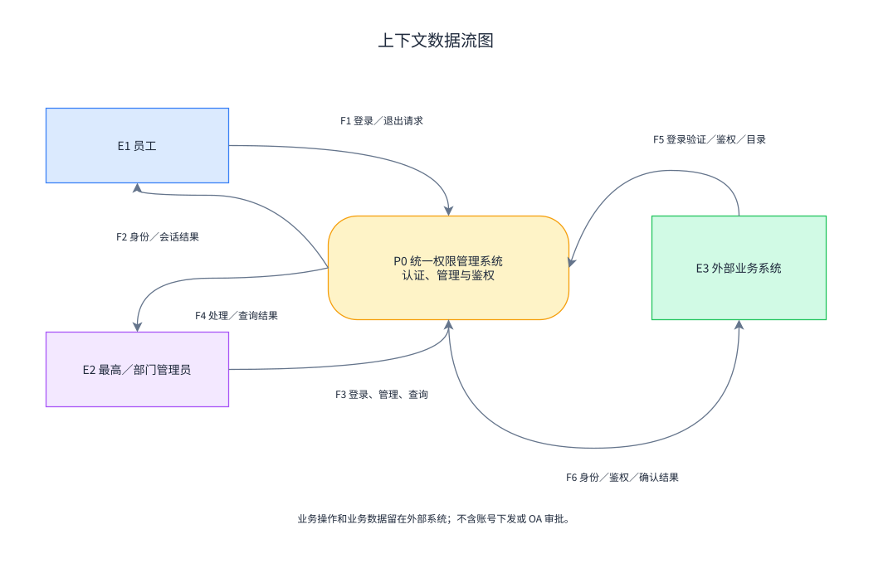

| 流编号 | 平台边界信息流 |
| --- | --- |
| F1／F2 | 员工提交登录与退出请求，取得认证结果和会话状态。 |
| F3／F4 | 管理员提交后台登录、管理变更和查询，取得处理结果及审计查询结果。 |
| F5／F6 | 外部系统提交登录接入、登录结果验证、鉴权请求和目录变更，取得身份、鉴权及目录确认结果。 |

员工浏览器的跳转由登录过程连接两个系统；业务操作的原始数据仍停留在外部业务系统。图中不绘制 OA 审批或账号下发。

### 3.3 一级数据流

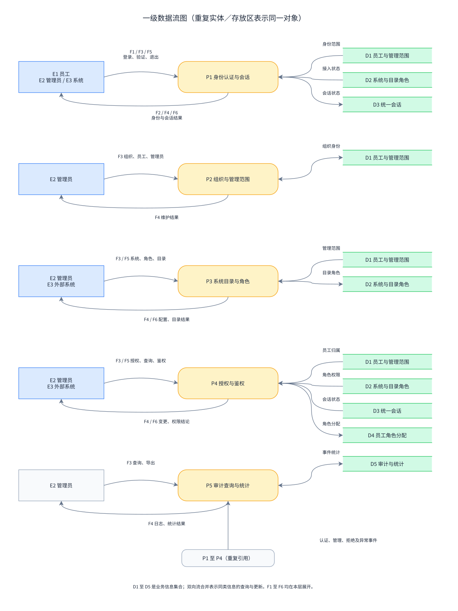

| 处理 | 责任 | 信息集合 |
| --- | --- | --- |
| P1 身份认证与会话 | 员工和管理员身份校验、跳转结果、会话复用、到期与退出 | D1 员工与管理范围、D2 系统与目录角色、D3 统一会话 |
| P2 组织与管理范围 | 公司、部门、员工及管理员身份维护 | D1 员工与管理范围 |
| P3 系统目录与角色 | 系统接入、部门可用系统、权限目录、模板和部门角色 | D2 系统与目录角色 |
| P4 授权与鉴权 | 角色分配、撤销、有效权限查询、运行时操作判断 | D1、D2、D3、D4 员工角色分配 |
| P5 审计查询与统计 | 接收事件，按范围查询导出，统计运行结果 | D5 审计与统计 |

D1 至 D5 表示业务信息集合。信息集合之间不直接传递数据，由处理读取或改变。

F1、F2 在 P1 展开；F3、F4 按目的进入 P1 至 P5；F5、F6 在 P1、P3、P4 展开。一级图中的子流共同覆盖上下文图的全部边界信息。

### 3.4 关键二级数据流

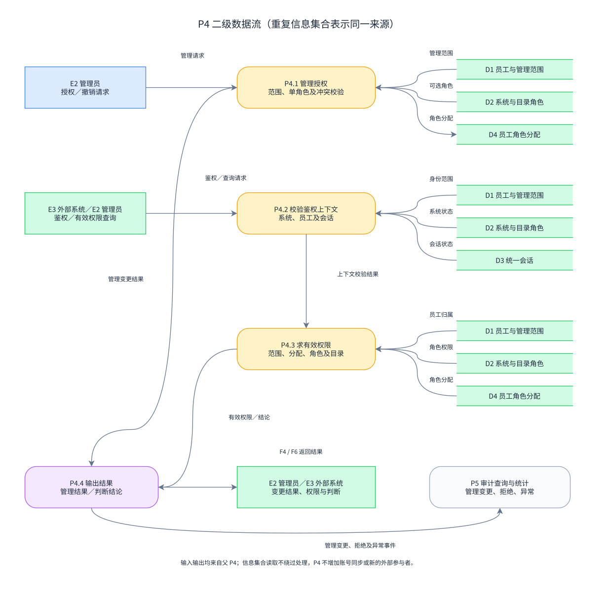

P4 分解为 P4.1 管理授权、P4.2 校验鉴权上下文、P4.3 求有效权限、P4.4 输出判断与变更结果。P4.1 改变 D4；P4.2 读取员工、系统和会话状态并输出校验结果；P4.3 对无效上下文直接生成拒绝结论，对有效上下文综合部门范围、角色及目录；P4.4 返回结论并交给 P5 记录拒绝、异常或管理变更。

管理查询校验操作者会话与管理范围，可以查询尚未登录的员工；运行时鉴权校验目标员工的当前统一会话。查询有效角色不要求目标员工先登录。

父处理的管理请求、运行时鉴权请求、查询请求和相应结果均出现在子图边界。子处理不增加新的外部参与者。DFD 表达信息如何被处理，时间顺序和条件分支见第 4.3 节。

## 4 功能需求

### 4.1 功能划分

| 参与者 | 使用方式 |
| --- | --- |
| 普通员工 | 经外部系统使用统一登录、会话复用及统一退出；不进入管理后台。 |
| 最高管理员 | 全局管理、模板维护、部门可用系统配置，及部门操作代办。 |
| 部门管理员 | 本部门员工、部门角色、授权和范围内日志管理。 |
| 外部系统 | 发起登录接入，验证登录结果，执行受控操作前鉴权，上报权限目录。 |

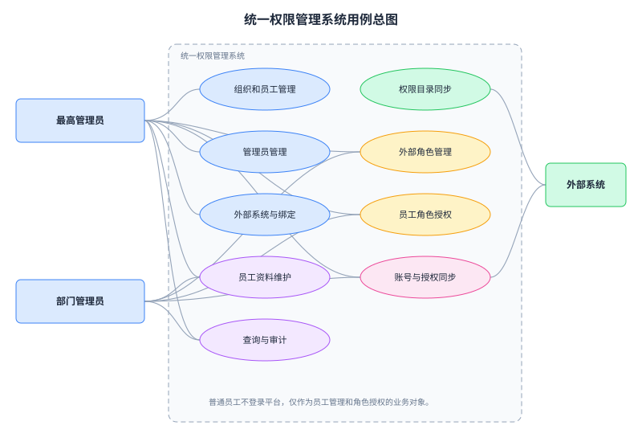

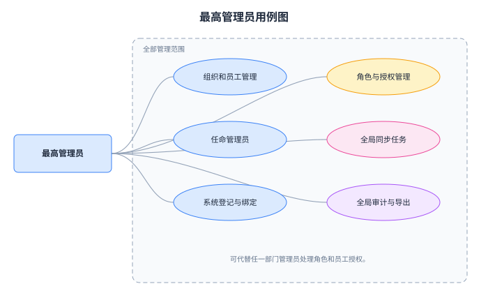

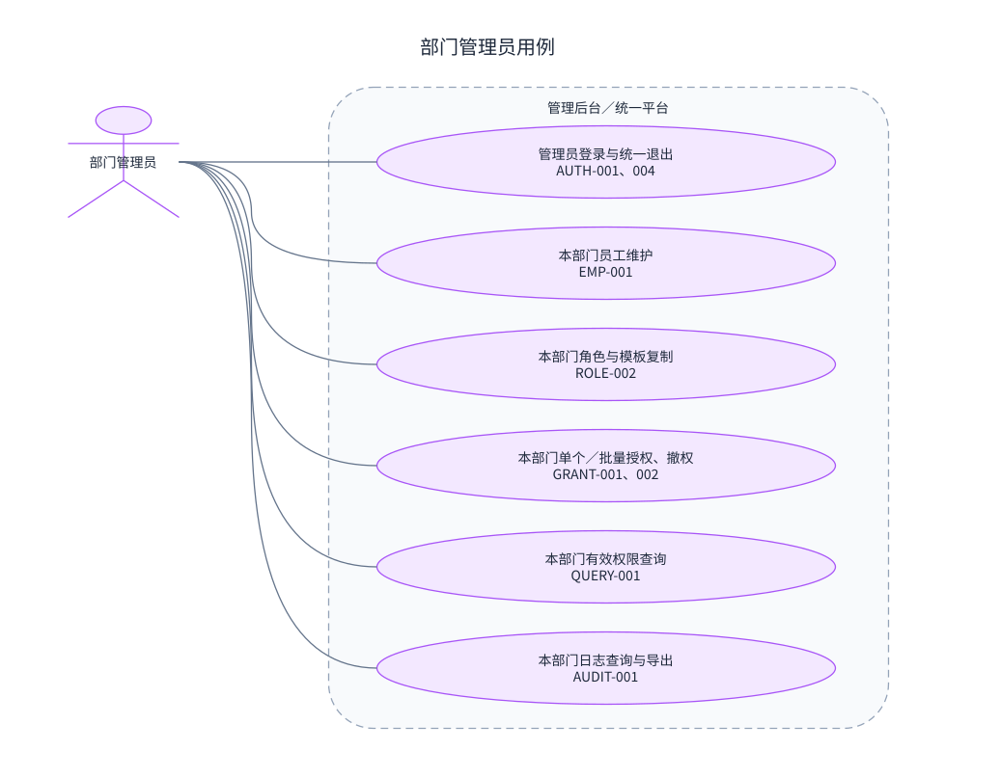

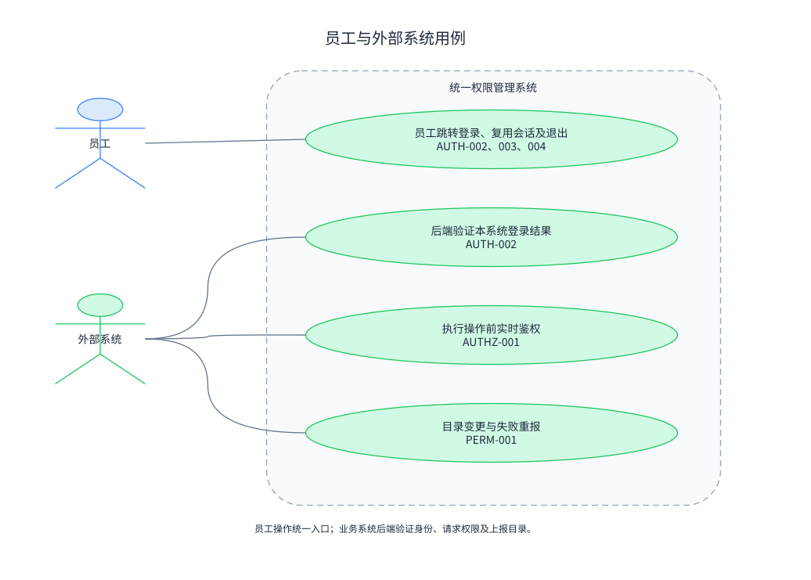

### 4.2 功能描述

下列表格沿用参考 PDF 的用例信息项目，并增加前置、后置条件。“信息”描述业务概念，不规定请求字段。

#### 4.2.1 管理员登录

| 项目 | 内容 |
| --- | --- |
| 用例编号 | UPMS-REQ-AUTH-001 |
| 用例名称 | 管理员登录 |
| 级别 | 用户目标 |
| 包 | 身份认证与会话 |
| 参与者 | 最高管理员、部门管理员 |
| 描述 | 管理员通过统一身份校验进入对应范围的后台。 |
| 触发事件 | 管理员打开后台并提交登录资料，或携带已有统一会话访问后台。 |
| 前置条件 | 员工有效，已具有有效管理员身份。 |
| 主成功场景 | 1. 校验用户名、手机号属于同一员工，或验证已有会话。 2. 校验管理员身份及范围。 3. 建立或复用统一会话，显示对应后台功能。 |
| 信息 | 员工身份、管理员身份、管理部门、会话状态、结果。 |
| 扩展场景 | 信息缺失、不匹配或员工停用时拒绝；普通员工身份正确时仍拒绝进入后台；管理员身份取消后不再允许后台访问。 |
| 后置条件 | 成功或失败写入认证审计；无外部业务角色自动产生。 |
| 其他 | 失败提示不暴露用户名或手机号是否存在；后台退出执行 AUTH-004。 |

#### 4.2.2 员工统一登录

| 项目 | 内容 |
| --- | --- |
| 用例编号 | UPMS-REQ-AUTH-002 |
| 用例名称 | 员工经业务系统统一登录 |
| 级别 | 用户目标 |
| 包 | 身份认证与会话 |
| 参与者 | 员工、外部系统 |
| 描述 | 员工跳转至统一登录页，业务系统验证登录结果后识别员工。 |
| 触发事件 | 未登录员工选择业务系统的统一登录入口。 |
| 前置条件 | 目标系统已登记、有效，返回目标已认可；员工资料存在。 |
| 主成功场景 | 1. 业务系统发起登录跳转。 2. 平台显示目标系统及统一登录页。 3. 员工提交用户名与手机号。 4. 校验员工有效并建立会话。 5. 浏览器返回认可的业务系统。 6. 业务系统后端验证登录结果，取得员工统一身份。 |
| 信息 | 发起系统、员工身份、统一会话、返回目标、登录结果。 |
| 扩展场景 | 未登记或停用系统、未认可返回目标拒绝；登录结果过期、篡改、跨系统使用或重复兑换拒绝；员工资料不匹配或停用拒绝；网络失败显示可重新发起登录。 |
| 后置条件 | 认证事件可追溯；业务系统只得到经验证的身份，访问权限仍需鉴权。 |
| 其他 | 外部系统不收集用户名和手机号；本期不要求直接提交登录凭据的接入模式。 |

#### 4.2.3 跨系统会话复用

| 项目 | 内容 |
| --- | --- |
| 用例编号 | UPMS-REQ-AUTH-003 |
| 用例名称 | 复用统一会话进入其他系统 |
| 级别 | 用户目标 |
| 包 | 身份认证与会话 |
| 参与者 | 员工、外部系统 |
| 描述 | 同一浏览器已有有效统一会话时，进入另一个系统免重复输入资料。 |
| 触发事件 | 员工从系统 A 进入系统 B 的统一登录入口。 |
| 前置条件 | 系统 B 有效，统一会话有效。 |
| 主成功场景 | 1. B 发起跳转。 2. 平台验证统一会话及员工状态。 3. 为 B 产生新的登录结果。 4. B 后端验证并识别同一员工。 5. B 独立判断自己的业务访问权限。 |
| 信息 | 当前会话、目标系统、员工身份、登录结果。 |
| 扩展场景 | 会话到期或失效时要求重新登录；无 B 的角色时身份可被识别，受控功能仍拒绝。 |
| 后置条件 | 原会话到期时间不延长，不复用 A 的登录结果。 |
| 其他 | 浏览器间、设备间不要求共享会话。 |

#### 4.2.4 统一退出

| 项目 | 内容 |
| --- | --- |
| 用例编号 | UPMS-REQ-AUTH-004 |
| 用例名称 | 结束当前统一会话 |
| 级别 | 用户目标 |
| 包 | 身份认证与会话 |
| 参与者 | 员工、管理员、外部系统 |
| 描述 | 在任一入口退出，使同一统一会话的所有系统后续请求失效。 |
| 触发事件 | 用户在后台或业务系统选择统一退出。 |
| 前置条件 | 存在当前会话；业务系统退出请求来源可信。 |
| 主成功场景 | 1. 平台确认当前会话并标记失效。 2. 返回退出结果。 3. 外部系统清理本地会话关联。 4. 最多 3 秒后，其他系统不得继续通过该会话鉴权。 |
| 信息 | 当前会话、发起入口、退出时间、处理结果。 |
| 扩展场景 | 重复退出返回已退出状态；平台不可用时系统只清理本地关联、提示统一退出未确认，并拒绝受控操作，不宣称全局退出成功。 |
| 后置条件 | 退出记录可查询；其他独立浏览器会话不受影响。 |
| 其他 | 已显示页面不要求自动关闭，但后续受控操作必须重新登录。 |

#### 4.2.5 组织维护

| 项目 | 内容 |
| --- | --- |
| 用例编号 | UPMS-REQ-ORG-001 |
| 用例名称 | 维护公司和部门 |
| 级别 | 用户目标 |
| 包 | 组织管理 |
| 参与者 | 最高管理员 |
| 描述 | 查询、新增、修改、停用公司与部门。 |
| 触发事件 | 最高管理员提交组织变更。 |
| 前置条件 | 有效最高管理员会话。 |
| 主成功场景 | 1. 展示公司、部门及状态。 2. 提交变更。 3. 校验公司归属、部门层级及同公司内名称。 4. 保存并记录审计。 |
| 信息 | 公司、部门、所属关系、状态。 |
| 扩展场景 | 部门包含下级部门或同公司重复名称时拒绝；停用对象有有效员工、管理员或可用系统关系时，提示先处理关联对象。 |
| 后置条件 | 组织资料一致；历史审计保留。 |
| 其他 | 不以部门名称跨公司合并对象。 |

#### 4.2.6 员工维护

| 项目 | 内容 |
| --- | --- |
| 用例编号 | UPMS-REQ-EMP-001 |
| 用例名称 | 维护员工资料与状态 |
| 级别 | 用户目标 |
| 包 | 员工管理 |
| 参与者 | 最高管理员、部门管理员 |
| 描述 | 维护授权对象及统一登录身份，部门管理员限本部门。 |
| 触发事件 | 管理员查询、提交资料或停用员工。 |
| 前置条件 | 有效管理员会话，对目标员工有管理范围。 |
| 主成功场景 | 1. 按姓名、用户名、公司、部门或手机号筛选。 2. 新增或修改资料，校验必填和唯一性。 3. 保存并审计。 4. 停用时撤销全部系统角色分配并使所有会话失效，最多 3 秒影响鉴权。 |
| 信息 | 身份资料、组织、岗位、员工状态、受影响角色与会话。 |
| 扩展场景 | 重复用户名或手机号拒绝；越部门提交整批拒绝；已归属部门员工的部门变更一律转 EMP-002，即使没有业务角色也不能跳过调动校验；停用失败不显示已完成。 |
| 后置条件 | 资料或状态更新；停用员工不能登录或通过鉴权。 |
| 其他 | 身份资料修改不推送外部账号。修改手机号不自动重新授予角色。重新启用不恢复停用时已撤销的分配。公司直属员工首次明确部门由最高管理员处理，不自动任命部门管理员。 |

#### 4.2.7 跨部门调动

| 项目 | 内容 |
| --- | --- |
| 用例编号 | UPMS-REQ-EMP-002 |
| 用例名称 | 手工撤权后调动员工 |
| 级别 | 用户目标 |
| 包 | 员工管理 |
| 参与者 | 原部门管理员、最高管理员、新部门管理员 |
| 描述 | 协作完成撤销旧授权、变更部门及重新授权。 |
| 触发事件 | 线下通知员工调动。 |
| 前置条件 | 目标部门有效；各操作者有相应范围。 |
| 主成功场景 | 1. 原部门撤销全部系统角色，核对逐系统结果及撤权生效。 2. 最高管理员校验无未撤销分配，取消原部门管理员身份（若有）。 3. 修改部门。 4. 新部门按获准系统重新选择角色并授权。 |
| 信息 | 原部门、新部门、原分配、撤权结果、管理员身份、新分配。 |
| 扩展场景 | 存在未撤销分配或撤权尚未生效时禁止调动；调动与新增授权同时发生时拒绝冲突，要求刷新重新处理；新部门尚无角色时保持无授权。 |
| 后置条件 | 员工只按新部门范围授权；原部门失去管理权。 |
| 其他 | 最高管理员可代办原部门撤权；不自动继承旧角色，不自动成为新部门管理员。 |

#### 4.2.8 管理员任命

| 项目 | 内容 |
| --- | --- |
| 用例编号 | UPMS-REQ-ADM-001 |
| 用例名称 | 任命、取消管理员 |
| 级别 | 用户目标 |
| 包 | 管理范围 |
| 参与者 | 最高管理员 |
| 描述 | 从有效员工中任命或取消固定平台管理身份。 |
| 触发事件 | 最高管理员确认身份变更。 |
| 前置条件 | 有效最高管理员会话；任命对象有效。 |
| 主成功场景 | 1. 选员工及管理身份。 2. 任命部门管理员时确认其实际部门。 3. 保存身份与范围。 4. 后续后台访问最多 3 秒按新范围判断。 |
| 信息 | 员工、身份、所属部门、状态、变更结果。 |
| 扩展场景 | 公司直属、部门未明确员工不能任命为部门管理员；不得取消或停用最后一名有效最高管理员；当前最高管理员取消本人身份须由另一名最高管理员执行。 |
| 后置条件 | 任命和取消留痕，不改变外部业务角色。 |
| 其他 | 同时有多个身份时，最高管理员使用全局范围；平台角色定义不可编辑。 |

#### 4.2.9 系统及部门可用范围

| 项目 | 内容 |
| --- | --- |
| 用例编号 | UPMS-REQ-SYS-001 |
| 用例名称 | 维护系统接入与部门可用系统 |
| 级别 | 用户目标 |
| 包 | 系统接入 |
| 参与者 | 最高管理员 |
| 描述 | 登记系统、认可返回目标、启停及维护多对多可用关系。 |
| 触发事件 | 最高管理员提交系统或范围变更。 |
| 前置条件 | 有效最高管理员会话；关联部门有效。 |
| 主成功场景 | 1. 登记唯一系统标识、名称和业务接入信息。 2. 配置可使用该系统的部门。 3. 显示受影响角色及员工数并确认。 4. 保存、审计，最多 3 秒影响登录接入与鉴权。 |
| 信息 | 系统身份、状态、认可返回目标、部门范围、目录状态。 |
| 扩展场景 | 系统标识冲突拒绝；未登记系统接入拒绝；移除范围或停用前明确显示访问影响；重新启用需提示保留配置可能恢复访问。 |
| 后置条件 | 只有有效系统及获准部门可形成有效授权。 |
| 其他 | 删除关联不删除历史审计。模板或目录名称相同不合并系统。 |

#### 4.2.10 权限目录接收与失败重报

| 项目 | 内容 |
| --- | --- |
| 用例编号 | UPMS-REQ-PERM-001 |
| 用例名称 | 接收、更新及停用目录权限 |
| 级别 | 用户目标 |
| 包 | 权限目录 |
| 参与者 | 外部系统、最高管理员 |
| 描述 | 接收已识别系统来源的目录变更，不完整输入不覆盖已确认目录。 |
| 触发事件 | 外部系统首次接入或目录变更、失败后重新上报。 |
| 前置条件 | 系统已登记且允许接入；上报来源与目标系统匹配。 |
| 主成功场景 | 1. 提交目录及变更含义。 2. 校验系统归属、标识唯一和内容完整性。 3. 整体确认新目录。 4. 停用项从有效角色中排除，新增项不自动授予。 5. 返回确认结果并记录事件。 |
| 信息 | 系统、模块、功能点、动作、状态、变更及确认结果。 |
| 扩展场景 | 内容冲突或不完整时整体拒绝、保留旧目录；网络未确认时外部系统重报同一变更；重复或过期变更不得回退目录或重复建立权限；失败可在后台查看，由最高管理员组织外部系统修正重报。 |
| 后置条件 | 确认后的停用项最多 3 秒影响后续鉴权。 |
| 其他 | 缺失项不自动视为删除，停用必须明确表达；重新启用项须重新配置角色才能恢复授予，防止旧配置意外恢复。 |

#### 4.2.11 全局角色模板

| 项目 | 内容 |
| --- | --- |
| 用例编号 | UPMS-REQ-ROLE-001 |
| 用例名称 | 维护全局模板 |
| 级别 | 用户目标 |
| 包 | 角色管理 |
| 参与者 | 最高管理员 |
| 描述 | 按系统维护初始五类及后续模板。 |
| 触发事件 | 最高管理员新增、修改、停用模板。 |
| 前置条件 | 系统目录已确认；有效最高管理员会话。 |
| 主成功场景 | 1. 选择系统与模板。 2. 从该系统有效权限中配置集合。 3. 校验同系统模板名称唯一。 4. 保存并审计。 |
| 信息 | 系统、模板、权限集合、状态。 |
| 扩展场景 | 跨系统或停用权限拒绝；停用模板后不能再复制；修改模板不覆盖已有部门角色。 |
| 后置条件 | 模板供复制，不能直接分配员工。 |
| 其他 | 模板的岗位名称不自动对应员工岗位或管理员身份。 |

#### 4.2.12 部门角色

| 项目 | 内容 |
| --- | --- |
| 用例编号 | UPMS-REQ-ROLE-002 |
| 用例名称 | 新建、修改、停用部门角色 |
| 级别 | 用户目标 |
| 包 | 角色管理 |
| 参与者 | 最高管理员、部门管理员 |
| 描述 | 在获准系统内复制模板或自建本部门角色。 |
| 触发事件 | 管理员提交部门角色配置。 |
| 前置条件 | 部门与系统有效且关系获准；操作者具有部门范围。 |
| 主成功场景 | 1. 选择部门、系统。 2. 复制有效模板或新增角色。 3. 配置该系统有效权限。 4. 显示受影响员工数并保存。 5. 最多 3 秒更新相关鉴权结果。 |
| 信息 | 归属部门、系统、角色、权限集合、分配人数。 |
| 扩展场景 | 越范围、跨系统权限、同部门同系统重名拒绝；停用角色使分配失去有效权限；删除仍有分配的角色拒绝。 |
| 后置条件 | 角色独立于模板维护，不影响其他部门角色。 |
| 其他 | 无权限角色可保存供配置，但不能通过任何受控操作鉴权；重新启用前显示仍保留的分配及恢复影响。 |

#### 4.2.13 角色分配与替换

| 项目 | 内容 |
| --- | --- |
| 用例编号 | UPMS-REQ-GRANT-001 |
| 用例名称 | 单个或批量分配、替换角色 |
| 级别 | 用户目标 |
| 包 | 授权管理 |
| 参与者 | 最高管理员、部门管理员 |
| 描述 | 为员工在一个系统选择一个本部门角色，已有分配时明确替换。 |
| 触发事件 | 管理员选择员工、系统与目标角色并确认。 |
| 前置条件 | 员工有明确部门；员工、部门、系统、关系和角色有效。 |
| 主成功场景 | 1. 筛选并勾选员工。 2. 展示各人当前角色及目标角色。 3. 有旧角色时提示替换。 4. 确认后校验管理范围并处理分配。 5. 展示逐人成功、失败及生效状态。 |
| 信息 | 系统、员工、旧角色、目标角色、逐人结果、生效期限。 |
| 扩展场景 | 选中其他部门员工或角色越范围时整批拒绝；有效范围内个别状态变化可逐项失败并保留成功项；并发换角检测冲突，不静默覆盖；重复同角色分配不增加记录。 |
| 后置条件 | 每员工每系统至多一个未撤销分配，成功项最多 3 秒生效。 |
| 其他 | 批量受理不等于全部成功；变更不创建外部账号。 |

#### 4.2.14 撤销角色

| 项目 | 内容 |
| --- | --- |
| 用例编号 | UPMS-REQ-GRANT-002 |
| 用例名称 | 单个、批量或全部系统撤权 |
| 级别 | 用户目标 |
| 包 | 授权管理 |
| 参与者 | 最高管理员、部门管理员 |
| 描述 | 撤销所选员工在指定系统的角色，或撤销调动前全部系统角色。 |
| 触发事件 | 管理员确认撤权范围。 |
| 前置条件 | 有员工管理权限。 |
| 主成功场景 | 1. 展示员工、系统和当前分配。 2. 确认撤权。 3. 平台撤销目标分配并审计。 4. 最多 3 秒后该范围内的后续鉴权拒绝。 5. 显示逐项变更与生效状态。 |
| 信息 | 撤权范围、原角色、结果、撤权时间。 |
| 扩展场景 | 无分配返回已无授权；越范围整批拒绝；个别保存失败显示独立失败；失败项可重新发起撤权，不恢复已成功项。 |
| 后置条件 | 撤销一个系统不影响其他系统角色，不结束身份会话。 |
| 其他 | 撤权与员工停用分别处理；员工停用影响所有系统及会话。 |

#### 4.2.15 运行时鉴权

| 项目 | 内容 |
| --- | --- |
| 用例编号 | UPMS-REQ-AUTHZ-001 |
| 用例名称 | 判断业务操作权限 |
| 级别 | 子功能 |
| 包 | 授权与鉴权 |
| 参与者 | 外部系统 |
| 描述 | 平台对某员工在请求系统的功能点及动作返回允许或拒绝。 |
| 触发事件 | 外部系统后端准备执行受控操作。 |
| 前置条件 | 调用系统身份可信，能提供已验证员工及当前会话上下文。 |
| 主成功场景 | 1. 核验调用系统与目标系统一致。 2. 核验会话未到期、未退出且员工有效。 3. 核验系统、部门范围、分配、角色及权限项有效。 4. 判断当前角色包含请求操作。 5. 返回结论；外部系统仅在允许后执行业务操作及“本人”等范围校验。 |
| 信息 | 系统、员工与会话、功能点、动作、结论、原因类别。 |
| 扩展场景 | 缺失上下文、无角色、未知或停用操作、跨系统请求均拒绝；平台超时、不可用或无法可靠判断时外部系统不执行并提示重试。 |
| 后置条件 | 拒绝和异常记录审计，允许结果计入统计；鉴权不修改角色。 |
| 其他 | 前端按钮隐藏不能替代后端鉴权。判断最多陈旧 3 秒；外部系统不独立长期缓存允许结果。 |

#### 4.2.16 查询有效角色与权限

| 项目 | 内容 |
| --- | --- |
| 用例编号 | UPMS-REQ-QUERY-001 |
| 用例名称 | 查询员工各系统角色和有效权限 |
| 级别 | 用户目标 |
| 包 | 查询 |
| 参与者 | 最高管理员、部门管理员 |
| 描述 | 按员工、部门、系统、角色和状态查看授权及失效原因。 |
| 触发事件 | 管理员筛选或查看详情。 |
| 前置条件 | 有效管理员会话及相应员工范围。 |
| 主成功场景 | 1. 按范围筛选。 2. 显示每系统角色、权限及角色／系统／部门范围状态。 3. 查看配置变更时间和最迟生效时间。 |
| 信息 | 分配、有效权限、失效原因、配置状态、生效状态。 |
| 扩展场景 | 无角色显示未授权；越范围拒绝并留痕；变更后 3 秒内不能只显示笼统“已经生效”，应说明最迟生效期限。 |
| 后置条件 | 不改变业务配置。 |
| 其他 | 查询使用与鉴权相同的有效权限规则，不查询外部账号副本。 |

#### 4.2.17 审计查询与导出

| 项目 | 内容 |
| --- | --- |
| 用例编号 | UPMS-REQ-AUDIT-001 |
| 用例名称 | 查询、查看和导出审计记录 |
| 级别 | 用户目标 |
| 包 | 审计 |
| 参与者 | 最高管理员、部门管理员 |
| 描述 | 查询认证、退出、管理变更、目录确认、鉴权拒绝和异常。 |
| 触发事件 | 管理员筛选、查看详情或导出。 |
| 前置条件 | 有效管理员会话及日志管理范围。 |
| 主成功场景 | 1. 按时间、操作者、部门、系统、事件和结果筛选。 2. 返回范围内记录。 3. 查看变更前后内容、失败原因和关联事件。 4. 导出当前筛选结果并记录导出行为。 |
| 信息 | 操作者、时间、范围、对象、事件、变化、结果、原因。 |
| 扩展场景 | 越部门查询或导出拒绝；无员工或部门归属的系统异常日志仅最高管理员可见；导出失败提示重试，不影响原日志。 |
| 后置条件 | 原记录不变，查询与导出留痕。 |
| 其他 | 不记录登录凭据原文或可复用会话凭据；允许鉴权仅统计，不逐条记录。 |

### 4.3 业务流程

#### 4.3.1 统一登录及跨系统访问

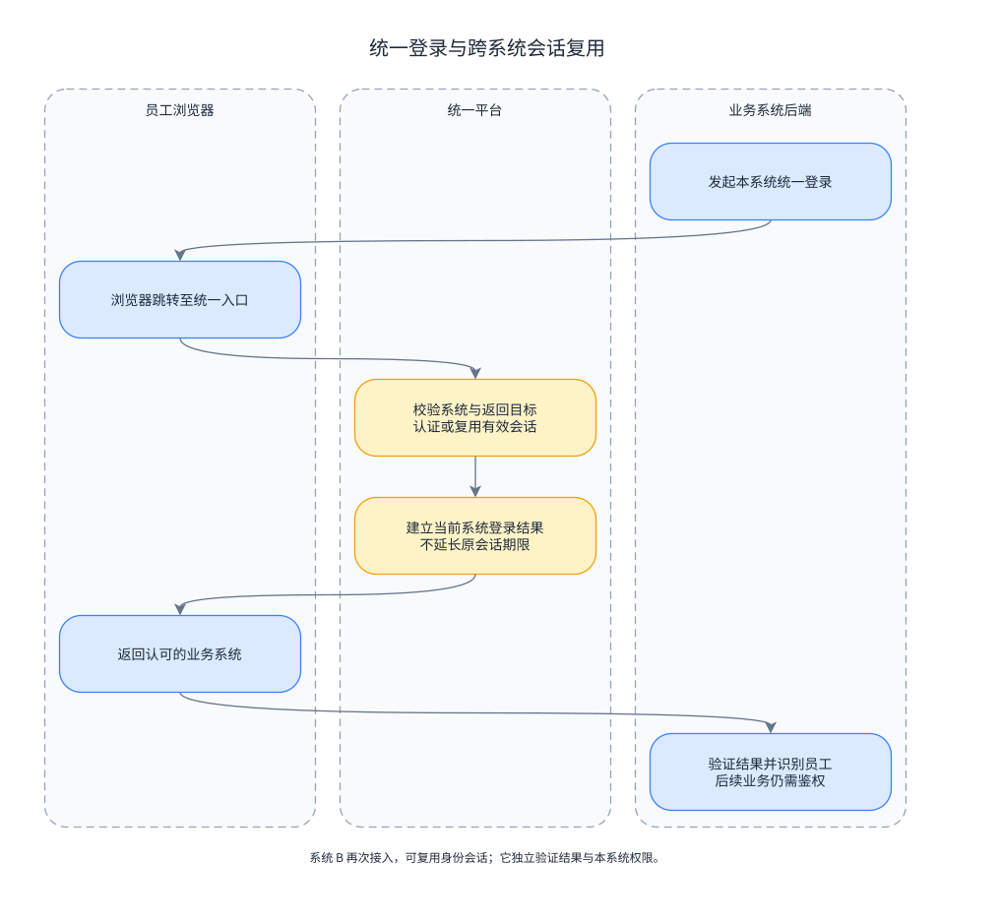

业务系统发起跳转，平台认证或复用会话，浏览器返回发起系统，由后端验证登录结果。进入其他系统再次走该系统的接入过程，可复用身份会话，但必须按目标系统独立鉴权。

#### 4.3.2 角色配置、分配与撤销

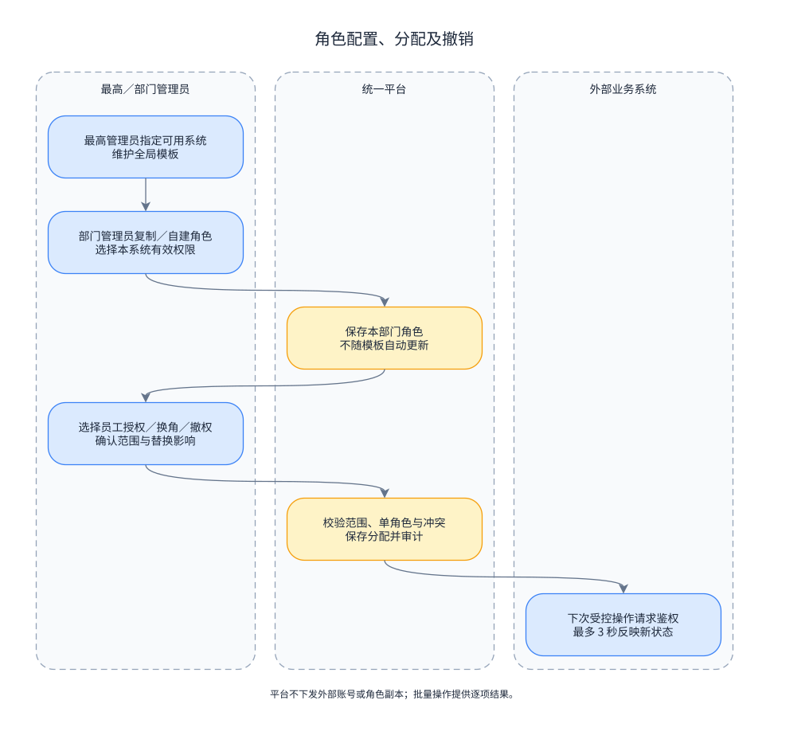

最高管理员决定部门可用系统和全局模板。部门管理员创建本部门角色，向员工分配。平台保存授权并在生效窗口内更新有效判断。撤权在平台完成，不再等待外部账号或角色同步。

#### 4.3.3 运行时鉴权与统一退出

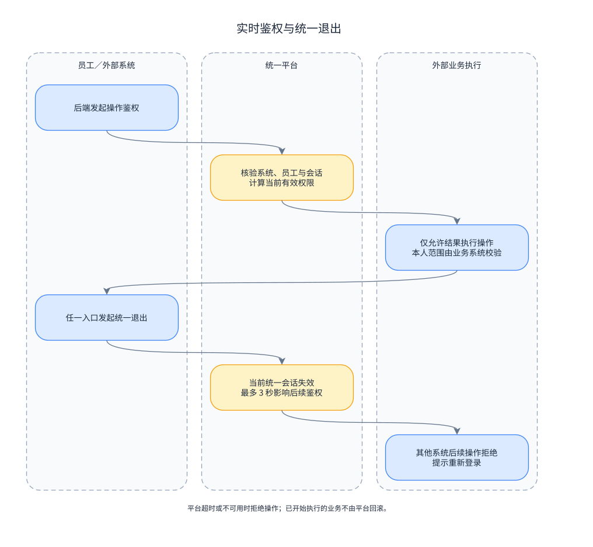

操作权限由业务系统后端请求。统一退出改变会话状态，撤权改变角色分配，两者分别校验。平台故障时拒绝受控操作；已开始执行的外部业务操作由外部系统处理。

#### 4.3.4 权限目录变更

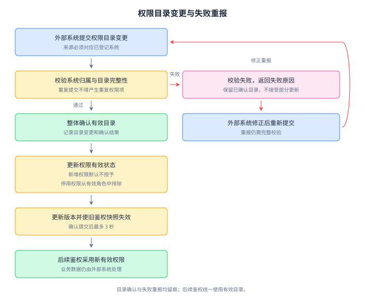

目录校验失败保留上一次已确认状态，由外部系统修正重报；成功确认后停用项最多 3 秒失效，新增项等待显式配置。重报必须幂等，不产生目录回退。

#### 4.3.5 跨部门调动

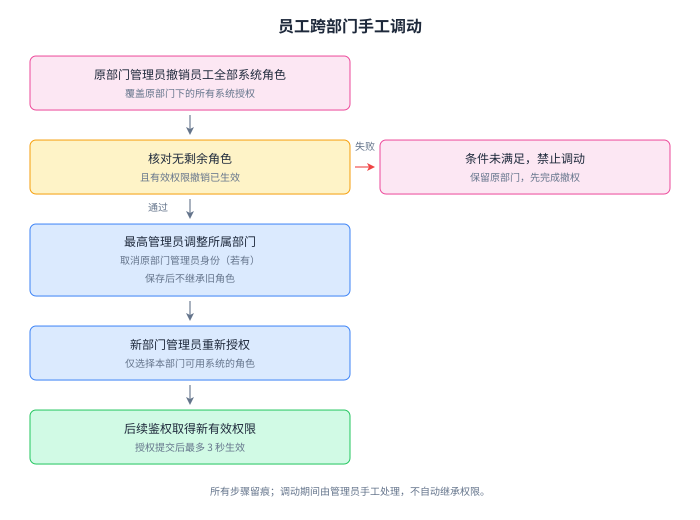

核对全部系统分配已撤销且撤权生效后，最高管理员调整部门。新部门独立授权。调动和分配的并发冲突必须检测。

## 5 性能需求

### 5.1 数据精确度

1. 身份资料唯一性、归属和每员工每系统单角色约束在并发操作下仍成立。
2. 不因同名公司岗位、部门、系统角色或模板而合并身份或权限。
3. 有效权限由当前状态组合得到，不将登录成功、部门可用系统或模板存在视为已授权。
4. 重复目录上报、授权、撤权或退出不产生重复授权，也不恢复已撤销权限。
5. 权限错误按零容忍验收；技术失败率预算不能用于容忍错误允许。
6. 批量操作保留逐项结果；管理成功与缓存生效期限分别展示。

### 5.2 时间特性

#### 5.2.1 性能目标

以下是待实现及实测的验收目标。

| 编号 | 工作负载与时长 | 指标与边界 |
| --- | --- | --- |
| ACC-P-001 | 10,000 个不同有效账号在 60 秒内均匀发起首次完整登录，之后等待全部请求结束 | 完整登录 P95 ≤ 3 秒，技术失败率 ≤ 1%；统计成功数、失败数、超时数、最大耗时及实际发起速率。 |
| ACC-P-002 | 10,000 个已登录账号轮转产生 1,000 次／秒鉴权，持续 5 分钟，共计划 300,000 次 | 平台鉴权调用 P95 ≤ 300 毫秒，技术失败率 ≤ 1%；实际发送量和完成量须报告，不用排队积压掩盖未达吞吐量。 |
| ACC-P-003 | 100 名管理员并发执行常用查询与单项操作，持续 5 分钟 | 查询、详情和单项管理操作 P95 ≤ 3 秒；无唯一性、单角色及隔离错误。 |
| ACC-P-004 | ACC-P-002 持续鉴权期间，同时施加 ACC-P-003 的管理员负载 | 两类请求分别统计，并各自满足其指标；登录峰值可单独测试。 |
| ACC-P-005 | 在持续鉴权下进行授权、换角、撤权、角色变更、目录停用、员工停用、部门可用系统范围取消、管理员身份取消及统一退出 | 从变更成功提交或退出确认起，最迟 3 秒后的每次新鉴权或后台管理请求必须反映新状态；旧允许结果不能因反复访问续期。 |

完整登录从测试客户端发起业务系统登录跳转开始，至业务系统后端验证结果并建立身份关联结束，包含跳转、认证和验证，排除人工输入等待。采用自动提交已准备凭据，不能只测单次身份匹配。

鉴权延迟从业务系统后端发出调用到收到可执行结论，包含平台会话与权限校验。本地测试排除外网延迟，仍包含本机通信和必要的数据读取。

常用管理员操作的基准构成为：员工或授权列表 40%、角色或权限详情 30%、单人授权／换角／撤权 20%、员工资料更新 10%。每名虚拟管理员收到结果后等待 1 秒再执行下一操作。鉴权基准为有效允许 80%、缺少操作权限的预期拒绝 20%，分布到两个模拟系统；另独立验证停用、未知权限、跨系统及失效会话。

批量提交最多 3 秒返回已受理结果并持续提供逐人状态。每个成功项从其提交完成起计算 3 秒生效窗口，不要求整批在 3 秒内处理完毕。

#### 5.2.2 复现与结果报告

1. 使用 10,000 人、17 系统目录基线；压测身份须有明确的部门和测试角色，可在测试副本中为 54 名直属员工明确归属，记录处理，不能改写来源表格。
2. 会话绝对到期、系统返回目标和测试授权在测试开始前准备完成。首次登录测试清空登录会话，并分别报告冷启动及预热情况。
3. 持续鉴权先预热 30 秒，正式统计其后 5 分钟；负载发生器按设定速率发起，不以系统变慢自动减少负载。
4. 记录硬件、操作系统、运行时、应用及数据库配置、负载发生器位置、数据准备、网络条件和缓存条件。同机压测说明客户端与服务端争用资源。
5. 延迟报告 P50、P95、最大值，并单列失败、超时及未完成请求。技术失败按计划应完成的请求或完整登录次数计算，预期拒绝独立计数。
6. 测试客户端超时上限：完整登录与管理员操作 10 秒、单次鉴权 3 秒。超时计失败；失败不能通过重新发送后从原统计中消失。
7. 功能正确性、3 秒生效上限、吞吐与延迟各自验收。指标失败时记录瓶颈及改进后结果，不以平均响应替代 P95。

### 5.3 适应性

平台可在 17 个系统基础上继续登记系统，接收不同目录，建立不同部门角色。新增系统和权限不需要统一为所有系统相同的功能集合。

单系统角色规则保持一致，跨系统权限分别计算。后续如采用多角色、直接个人权限或新组织层级，需要明确修改需求基线。本期不预置这些能力。

## 6 运行需求

### 6.1 软件接口

本节规定业务责任，具体协议与字段留给后续详细设计。

| 方向 | 交换目的 | 责任与结果 |
| --- | --- | --- |
| 业务系统／浏览器到平台 | 发起统一登录并指定认可的返回目标 | 平台识别发起系统，认证或复用会话，返回限定于该系统的登录结果。 |
| 业务系统后端到平台 | 验证登录结果 | 平台防止过期、跨系统、篡改和重复兑换，返回可用于业务识别的统一身份。 |
| 业务系统后端到平台 | 请求操作鉴权 | 校验系统身份与员工会话，只判断该系统登记的操作；返回允许、拒绝或无法确认。无法确认时外部系统拒绝执行。 |
| 用户／业务系统到平台 | 统一退出 | 平台使当前统一会话失效；业务系统清理本地关联，其余系统在后续请求中识别失效。 |
| 外部系统到平台 | 权限目录新增、变更、停用或重报 | 平台校验来源、完整性和变更顺序，整体确认或整体拒绝，保留可查询接收记录。 |
| 管理后台到平台 | 管理与查询 | 服务端校验管理员身份及对象范围，返回逐项结果、配置状态、生效期限或审计记录。 |

系统调用须具有可信系统身份。外部系统不能凭前端传入的任意员工身份代替已验证会话，不能验证或查询其他系统的登录结果和权限。

外部系统负责业务数据、前端交互、操作执行和“本人”等记录范围校验。平台不保存业务记录，不参与业务事务回滚。

### 6.2 故障处理

| 情况 | 要求 |
| --- | --- |
| 统一认证入口失败 | 不建立已成功会话，提示重新发起；业务系统不使用未验证身份。 |
| 鉴权超时或不可用 | 拒绝受控操作并提示重试；不沿用超过期限或无法确认的允许结果。 |
| 目录不完整、重复或乱序 | 失败保留已确认目录；重复变更幂等确认；过期变更不能覆盖新状态。 |
| 目录确认响应丢失 | 外部系统重报同一变更并取得明确结果，不将未收到响应视为停用已生效。 |
| 管理保存失败 | 不显示成功，不留下双角色或范围冲突；失败项可重新提交。 |
| 并发授权、换角或调动冲突 | 拒绝冲突变更并说明对象已变化，要求刷新；不能以最后一次覆盖代替冲突检测。 |
| 缓存不可用或失效更新失败 | 读取可靠新状态或拒绝，不能延长旧允许状态；3 秒上限仍适用。 |
| 统一退出未确认 | 清理当前系统关联，提示全局退出未确认；平台不可用期间受控操作拒绝。 |
| 审计存储失败 | 成功管理变更与审计一致保存，审计失败时该变更不提交、不报告成功；不确认新登录成功，暂停新的受控操作并明确提示。已结束的会话不因审计失败恢复，分别说明退出状态与记录失败。通过运行提示及诊断明确故障和审计缺口，恢复后重新校验，不宣称缺失事件已完整补录。本期不要求可靠暂存与恢复补录。 |

无需恢复已经执行的外部业务操作，也不要求故障期间绕过鉴权维持业务。恢复后请求重新校验，不自动恢复撤销授权。

## 7 其它需求

### 7.1 可用性

统一登录页显示发起系统和失败提示。后台支持常用筛选，明确区分未授权、配置失效、变更已提交和最迟生效期限。

批量操作、换角、停用、范围取消及统一退出需说明目标与影响后再确认。错误信息给出可执行的下一步，不显示凭据或技术堆栈。

### 7.2 权限隔离与安全

1. 范围校验覆盖列表、详情、变更、批量、日志和导出，不能仅隐藏菜单。
2. 系统调用身份、员工身份会话、部门管理范围和业务权限分别校验。
3. 未知、缺失、停用或无法确认的权限默认拒绝。
4. 平台管理员不自动成为外部系统管理员；五类模板也不代表平台身份。
5. 登录资料、可复用会话凭据不进入 URL、日志或导出。返回目标只能选已认可目标。
6. 员工停用影响全部会话，统一退出影响当前会话；管理员身份取消仅移除后台管理能力，不撤销员工正常业务角色。
7. 会话在不同系统的关联必须接受统一状态校验，外部系统不得独立延长统一会话期限。

### 7.3 审计与一致性

认证、退出、组织及员工维护、管理员任命、系统范围、目录确认及失败重报、模板和部门角色、授权撤销、鉴权拒绝和异常均可追溯。管理事件包含操作者、时间、范围、对象、变更前后及结果；登录失败记录避免保存凭据原文。

部门管理员仅能查询本部门关联事件；跨部门调动保留原、新归属，按各部门当时的事件范围查看。系统级及无法归属事件仅最高管理员可见。

运行统计包含调用量、允许、预期拒绝、技术异常及耗时。允许鉴权不逐条留痕；拒绝与异常不能被成功吞吐量掩盖。正常服务期间关键事件同步留痕；审计不可用时按第 6.2 节处理，并明确故障期间记录完整性未知。可靠暂存、恢复补录及去重属于后续扩展。

### 7.4 功能验收

| 编号 | 场景及预期 | 对应用例 |
| --- | --- | --- |
| ACC-F-001 | 装载 10 公司、101 部门、10,000 员工及 17 外部系统；54 名公司直属员工明确标记，无丢失、错配 | ORG-001、EMP-001、SYS-001 |
| ACC-F-002 | 用户名／手机号缺失、不匹配、员工停用均拒绝；身份正确的普通员工只能使用认证入口 | AUTH-001、AUTH-002 |
| ACC-F-003 | A 登录后进入 B 免重复输入；B 单独验证身份与权限，A 的登录结果不能被 B 兑换 | AUTH-002、AUTH-003 |
| ACC-F-004 | 登录结果过期、篡改、重复兑换或返回目标未认可均拒绝 | AUTH-002 |
| ACC-F-005 | 同一会话在 A 统一退出后，B 最迟 3 秒拒绝新操作；8 小时到期须重新登录 | AUTH-003、AUTH-004 |
| ACC-F-006 | 其他浏览器独立会话不因当前会话退出失效；员工停用使所有会话最迟 3 秒失效 | AUTH-004、EMP-001 |
| ACC-F-007 | 部门管理员跨部门查询、改角色、授权、批量或导出均拒绝；最高管理员可代办 | ADM-001、GRANT-001、AUDIT-001 |
| ACC-F-008 | 部门可用多个系统，同系统供多个部门使用；移除范围最迟 3 秒使相关权限失效 | SYS-001、AUTHZ-001 |
| ACC-F-009 | 模板不能直接分配；复制后修改模板不改变部门角色；改某部门角色不影响其他部门 | ROLE-001、ROLE-002 |
| ACC-F-010 | 每员工每系统单角色，换角提示替换；跨系统角色独立；并发换角不静默覆盖 | GRANT-001 |
| ACC-F-011 | 批量越范围整批拒绝；有效范围内部分失败显示逐项结果，重复提交不产生重复分配 | GRANT-001、GRANT-002 |
| ACC-F-012 | 无角色、角色无权限、未知动作、停用项及跨系统请求均拒绝；“本人”记录范围由模拟系统执行 | AUTHZ-001 |
| ACC-F-013 | 目录停用最迟 3 秒影响已登录员工；新增权限不自动授予；失败保留旧目录，重报不回退 | PERM-001、AUTHZ-001 |
| ACC-F-014 | 撤权保留身份登录、拒绝对应系统操作；员工停用撤销所有分配并阻止登录 | GRANT-002、EMP-001 |
| ACC-F-015 | 调动前核对全部角色已撤销并生效、取消旧部门管理员身份；零业务角色也须走调动校验，调动后不继承角色或部门管理员身份 | EMP-002 |
| ACC-F-016 | 断开鉴权服务、制造超时后，模拟系统拒绝业务操作，恢复后重新判断 | AUTHZ-001 |
| ACC-F-017 | 正常服务时登录、退出、管理变更、目录失败、鉴权拒绝与异常可查询导出；部门日志隔离，允许鉴权只统计。制造审计存储故障，验证管理变更未提交且未报告成功，新登录未确认成功，新受控操作被拒绝；退出已结束的会话不恢复，并提示审计失败。故障与恢复可识别，审计缺口明确；恢复后重新校验，不要求完整补录 | AUDIT-001 |
| ACC-F-018 | 唯一资料冲突、最后管理员取消、系统身份冒用均被阻止并可追溯 | EMP-001、ADM-001、AUTHZ-001 |

表内业务域编号均补全为 `UPMS-REQ-` 前缀定位。性能验收另按第 5.2 节执行。

### 7.5 课程演示与文档验收

使用 OA 和企业知识库两个模拟系统，各选取少量真实目录功能，演示不同操作权限。模拟系统只实现展示、受控操作和接入验证，不覆盖完整 OA 或知识库业务。

验收时讲清员工身份、角色权限和业务数据范围的区别；展示普通员工登录、管理后台授权、即时拒绝、3 秒撤权、跨系统复用与统一退出。

文档检查包括：七章结构和用例信息完整；图号、链接及需求编号可定位；上下文与各级 DFD 的信息流平衡；业务流程与有效权限规则一致；复杂图的 draw.io 与 SVG 内容一致。

代码完成后，依据配套指南检查需求与模块、实际代码位置和验证场景的对应关系。当前性能指标和代码一致性均属于待实现验收项。
